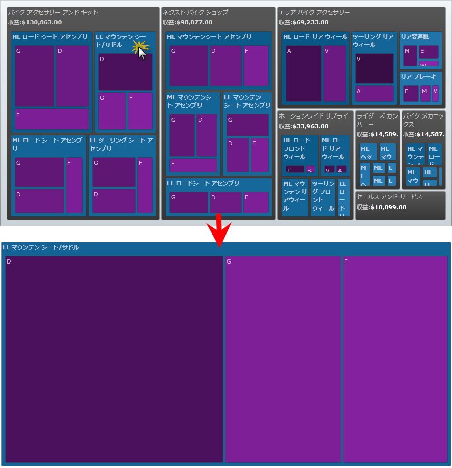

////

|metadata|
{
    "name": "xamtreemap-data-drill-down",
    "controlName": ["xamTreemap"],
    "tags": ["Drilldown","How Do I"],
    "guid": "a6b0c7cd-9739-4408-a6f4-bee59911c448",  
    "buildFlags": [],
    "createdOn": "2016-05-25T18:21:59.8663911Z"
}
|metadata|
////

= データ ドリルダウン

== 始める前に

このトピックでは、xamTreemap コントロールの link:{ApiPlatform}controls.charts.xamtreemap{ApiVersion}~infragistics.controls.charts.xamtreemap~itemssourceroot.html[ItemsSourceRoot] プロパティの使用方法を学びます。

ItemsSourceRoot プロパティによって、ユーザーは現在の DataContext のノードのどれをルートに設定するかを指定できます。

== 単純なドリルダウン アプリケーションの作成

[start=1]
. Microsoft® {PlatformName} アプリケーションを作成します。
[start=2]
. アプリケーションに xamTreemap コントロールのインスタンスを追加します。
[start=3]
. NodeMouseLeftButtonDown イベントを処理します。

*XAML の場合:*

----
<ig:xamTreemap 
    x:Name="Treemap"
    NodeMouseLeftButtonDown="Treemap_NodeMouseLeftButtonDown">
</ig:xamTreemap>
----

*Visual Basic の場合:*

----
Private Sub Treemap_NodeMouseLeftButtonDown _
(ByVal sender As Object, ByVal e As TreemapNodeClickEventArgs)
    If Treemap.ItemsSourceRoot <> e.Node.DataContext Then
        Treemap.ItemsSourceRoot = e.Node.DataContext
    End If
End Sub
----

*C# の場合:*

----
private void Treemap_NodeMouseLeftButtonDown(object sender, TreemapNodeClickEventArgs e)
{
    if (Treemap.ItemsSourceRoot != e.Node.DataContext)
    {
        Treemap.ItemsSourceRoot = e.Node.DataContext;
    }
}
----

[start=4]
. ドリルダウンとドリルしたルートを格納するためのカスタム ロジックを作成します。

関連トピック

link:xamtreemap-node-binders.html[ノード バインダー]

link:xamtreemap-value-mappers.html[値のマッパー]