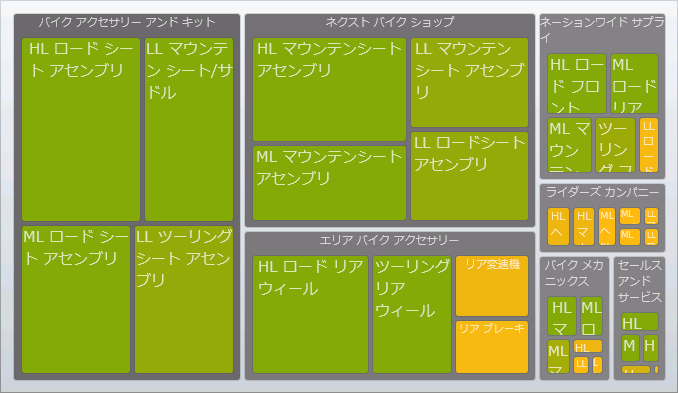
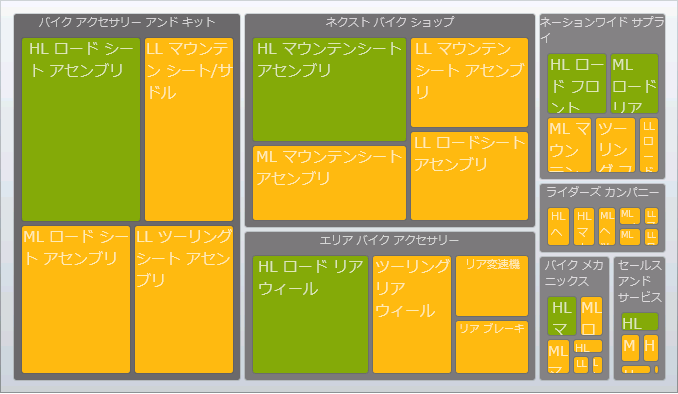
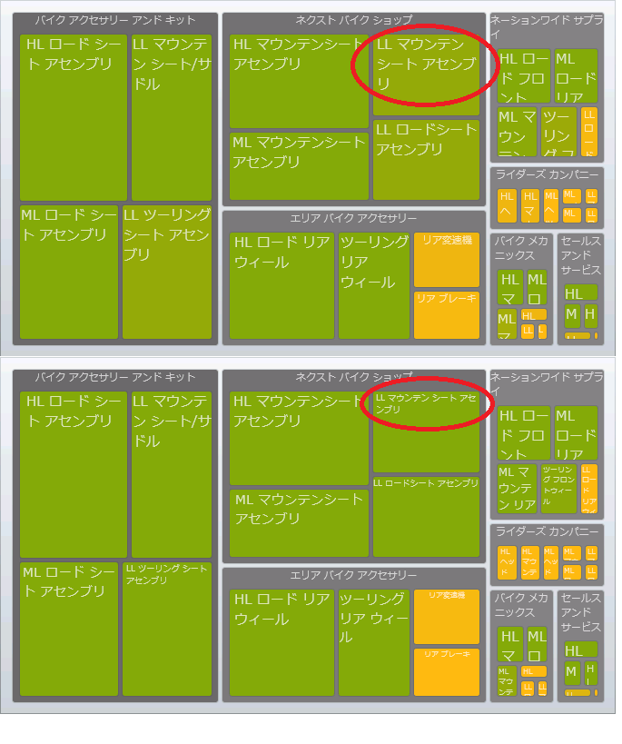

////

|metadata|
{
    "name": "xamtreemap-dataminimum-and-datamaximum",
    "controlName": ["xamTreemap"],
    "tags": ["Application Scenarios","How Do I"],
    "guid": "b65e2766-8861-4c1d-bc23-b3285d21ca67",  
    "buildFlags": [],
    "createdOn": "2016-05-25T18:21:59.8723907Z"
}
|metadata|
////

= DataMinimum と DataMaximum

== 始める前に

xamTreemap コントロールの link:{ApiPlatform}controls.charts.xamtreemap{ApiVersion}~infragistics.controls.charts.rangemapper~dataminimum.html[DataMinimum] プロパティと link:{ApiPlatform}controls.charts.xamtreemap{ApiVersion}~infragistics.controls.charts.rangemapper~datamaximum.html[DataMaximum] プロパティは link:{ApiPlatform}controls.charts.xamtreemap{ApiVersion}~infragistics.controls.charts.rangemapper.html[RangeMapper] クラスに属しています。RangeMapper クラスを継承するすべてのクラスは以下のプロパティを使用できます。

* link:xamtreemap-colormapper.html[ColorMapper]
* link:xamtreemap-radialcolormapper.html[RadialColorMapper]
* link:xamtreemap-doublemapper.html[DoubleMapper]

== 達成すること

DataMinimum プロパティと DataMaximum プロパティの目的、およびこれらのプロパティを効率的に使用する方法を理解します。

== シナリオ

このトピックは、Manufacturer、Product および InventoryEntry というクラスについて言及します。Product クラスの InventoryEntries プロパティには、InventoryEntry 項目のリストが含まれます。Manufacturer クラスの Products プロパティには、Product 項目のリストが含まれます。

image::images/xamTreemap_Node_Binders_01.png[]

このサンプルには、 link:xamtreemap-value-mappers.html[Value Mappers] を使用して Manufacturers のリストにバインドされている、xamTreemap コントロールのインスタンスが含まれています。
*XAML の場合:*

[source]
----
<ig:xamTreemap 
           Margin="5"
           LayoutType="Squarified"
           LayoutOrientation="Horizontal"
           ItemsSource="{Binding Path=Manufacturers}">

        <!--データにバインドします-->
        <ig:xamTreemap.NodeBinders>
                <ig:NodeBinder 
                       TargetTypeName="Manufacturer"
                       ValuePath="Revenue"
                       TextPath="Name"
                       ItemsSourcePath="Products"
                       NodeStyle="{StaticResource TreemapNodeStyle}" />
                <ig:NodeBinder 
                       TargetTypeName="Product"
                       ValuePath="StandardCost"
                       TextPath="Name"
                       NodeStyle="{StaticResource TreemapNodeStyle}" />
        </ig:xamTreemap.NodeBinders>
        <!--色マッパー-->
        <ig:xamTreemap.ValueMappers>
                <ig:ColorMapper 
                        ValueTypeName="Manufacturer"
                        ValuePath="Revenue"
                        TargetProperty="Fill"
                        MappingMode="AllNodes"
                        From="#FF838383"
                        To="#FF373737" />
                <ig:ColorMapper 
                        ValueTypeName="Product"
                        ValuePath="StandardCost"
                        TargetProperty="Fill"
                        MappingMode="AllNodes"
                        From="#ffba13"
                        To="#80a80b" />
                <ig:DoubleMapper 
                     ValueTypeName="Product"
                     ValuePath="StandardCost"
                     TargetProperty="FontSize"
                     MappingMode="AllNodes"
                     From="8"
                     To="15" />
        </ig:xamTreemap.ValueMappers>
</ig:xamTreemap>
----

ここで、Product 項目には、$500 から $10000 の範囲の StandardCost 値があり、オレンジと緑の間の色にマップされます。

== DataMinimum と DataMaximum

Product 項目の StandardCost のための値マッパーの DataMinimum プロパティと DataMaximum プロパティを設定します。

*XAML の場合:*

----
<ig:ColorMapper 
        ValueTypeName="Product"
        ValuePath="StandardCost"
        TargetProperty="Fill"
        MappingMode="AllNodes"
        From="#ffba13"
        To="#80a80b"
        DataMinimum="3000"
        DataMaximum="8000" />
----

この値マッパーを使用すると、DataMinimum 値よりも StandardCost 値が小さいすべての Product 項目は、ColorMapper の From プロパティに定義される Fill 値を取得します。この場合は Orange です。DataMaximum よりも StandardCost が大きい Product 項目は To プロパティで定義される Fill 値を取得します。この場合は Green です。

以下のコードは、Product 項目の StandardCost プロパティのための値マッパーの DataMinimum プロパティと DataMaximum プロパティを設定し、ノードの FontSize にマップする方法を示します。ノードの FontSize プロパティにマップすると、元となるデータ値に基づいてノードの表示フォント サイズに影響します。

*XAML の場合:*

----
<ig:DoubleMapper 
        ValueTypeName="Product"
        ValuePath="StandardCost"
        TargetProperty="FontSize"
        MappingMode="AllNodes"
        From="8"
        To="15"
        DataMinimum="7000"
        DataMaximum="9000" />
----

DataMinimum と DataMaximum を設定した場合と設定しない場合のノードのテキストの違いを確認してください。

== 概要

値マッパー オブジェクトで DataMinimum プロパティと DataMaximum プロパティの両方またはいずれか一方を設定すると、マップされた値が DataMinimum よりも小さいノードの場合、マップされたプロパティは From 値が設定され、マップされた値が DataMaximum よりも大きいノードの場合、マップされたプロパティは To 値が設定されます。

これによって、データではマップされた値の圧縮点の前後に範囲を作成することができます。

image::images/xamTreemap_DataMinimum_and_DataMaximum_04.png[]