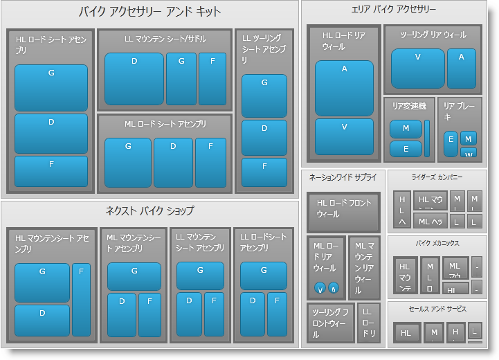

////

|metadata|
{
    "name": "xamtreemap-doublemapper",
    "controlName": ["xamTreemap"],
    "tags": ["How Do I"],
    "guid": "270e1ae9-2bf2-45e8-8ff2-79287603cb79",  
    "buildFlags": [],
    "createdOn": "2016-05-25T18:21:59.8543908Z"
}
|metadata|
////

= DoubleMapper

link:{ApiPlatform}controls.charts.xamtreemap{ApiVersion}~infragistics.controls.charts.doublemapper.html[DoubleMapper] はノードのデータ コンテキストによって xamTreemap コントロールのノードのテンプレートに数値を設定します。

== DoubleMapper プロパティ

* link:{ApiPlatform}controls.charts.xamtreemap{ApiVersion}~infragistics.controls.charts.valuemapper~valuepath.html[ValuePath] - データを含むデータ ソースのプロパティ名を決定します。
* link:{ApiPlatform}controls.charts.xamtreemap{ApiVersion}~infragistics.controls.charts.valuemapper~valuetypename.html[ValueTypeName] - ValuePath によって指定されるデータを含むフィールドを持つタイプの名前を決定します。
* link:{ApiPlatform}controls.charts.xamtreemap{ApiVersion}~infragistics.controls.charts.valuemapper~targetproperty.html[TargetProperty] - カラー マッピングによって影響を受けるプロパティを決定します。
* link:{ApiPlatform}controls.charts.xamtreemap{ApiVersion}~infragistics.controls.charts.valuemapper~targetname.html[TargetName] - xamTreemap コントロールのノードにカスタム テンプレートが定義されていて、名前付きの要素がある場合、この要素を指定するために TargetName を使用できます。
* link:{ApiPlatform}controls.charts.xamtreemap{ApiVersion}~infragistics.controls.charts.valuemapper~mappingmode.html[MappingMode] - カラー マッピングによって影響を受けるノードを決定します。可能となる値は "AllNodes" と "LeafNodesOnly" です。
* link:{ApiPlatform}controls.charts.xamtreemap{ApiVersion}~infragistics.controls.charts.doublemapper~from.html[From] および link:{ApiPlatform}controls.charts.xamtreemap{ApiVersion}~infragistics.controls.charts.doublemapper~to.html[To] - この 2 つのプロパティはノードのテンプレートに適用される値の範囲を決定します。
* link:{ApiPlatform}controls.charts.xamtreemap{ApiVersion}~infragistics.controls.charts.rangemapper~dataminimum.html[DataMinimum] および link:{ApiPlatform}controls.charts.xamtreemap{ApiVersion}~infragistics.controls.charts.rangemapper~datamaximum.html[DataMaximum] - ValuePath によって指定された値が特定のノードの DataMinimum より小さい場合、マッパーは From プロパティの値を適用します。ValuePath によって指定された値が特定のノードの DataMaximum より大きい場合、マッパーは To プロパティの値を適用します。

== 例

Manufacturer、Product および InventoryEntry という ３ つのクラスがあります。Product クラスには double フィールド StandardCost があります。Manufacturer クラスには整数フィールド Revenue があります。InventoryEntry クラスには整数フィールド Quantity があります。

*XAML の場合:*

----
<ig:xamTreemap.ValueMappers>
    <ig:DoubleMapper
        ValueTypeName="Manufacturer"
        ValuePath="Revenue"
        TargetProperty="FontSize"
        MappingMode="AllNodes"
        From="5"
        To="15" />
    <ig:DoubleMapper
        ValueTypeName="Product"
        ValuePath="StandardCost"
        TargetProperty="BorderThickness"
        MappingMode="AllNodes"
        From="1"
        To="5" />
    <ig:DoubleMapper
        ValueTypeName="InventoryEntry"
        ValuePath="Quantity"
        TargetProperty="CornerRadius"
        MappingMode="AllNodes"
        From="2"
        To="10" />
</ig:xamTreemap.ValueMappers>
----

== どのように動作するのか

最初のマッパーは Revenue に基づいてタイプ Manufacturer のノードの FontSize を設定します。

2 番目のマッパーは StandardCost に基づいてタイプ Product のノードの BorderThickness を設定します。

3 番目のマッパーは Quantity に基づいてタイプ InventoryEntry のノードの CornerRadius を設定します。

関連トピック

link:xamtreemap-node-binders.html[ノード バインダー]

link:xamtreemap-value-mappers.html[値のマッパー]