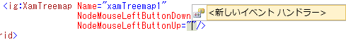

////

|metadata|
{
    "name": "xamtreemap-events",
    "controlName": ["xamTreemap"],
    "tags": ["Events","How Do I"],
    "guid": "ab84f57d-1240-46cb-bec4-1d8b913133f8",  
    "buildFlags": [],
    "createdOn": "2016-05-25T18:21:59.7973777Z"
}
|metadata|
////

= イベント

== 始める前に

xamTreemap コントロールには 以下のイベントがあります。

* link:{ApiPlatform}controls.charts.xamtreemap{ApiVersion}~infragistics.controls.charts.xamtreemap~nodemouseleftbuttondown_ev.html[NodeMouseLeftButtonDown]
* link:{ApiPlatform}controls.charts.xamtreemap{ApiVersion}~infragistics.controls.charts.xamtreemap~nodemouseleftbuttonup_ev.html[NodeMouseLeftButtonUp]

ifdef::sl,wpf[]
* link:{ApiPlatform}controls.charts.xamtreemap{ApiVersion}~infragistics.controls.charts.xamtreemap~nodemouserightbuttondown_ev.html[NodeMouseRightButtonDown]

endif::sl,wpf[]

ifdef::sl,wpf[]
* link:{ApiPlatform}controls.charts.xamtreemap{ApiVersion}~infragistics.controls.charts.xamtreemap~nodemouserightbuttonup_ev.html[NodeMouseRightButtonUp]

endif::sl,wpf[]

ifdef::wpf[]
* link:{ApiPlatform}controls.charts.xamtreemap{ApiVersion}~infragistics.controls.charts.xamtreemap~nodemousedoubleclick_ev.html[NodeMouseDoubleClick]

endif::wpf[]

ifdef::sl,wpf[]
* link:{ApiPlatform}controls.charts.xamtreemap{ApiVersion}~infragistics.controls.charts.xamtreemap~nodemousemove_ev.html[NodeMouseMove]

endif::sl,wpf[]

ifdef::sl,wpf[]
* link:{ApiPlatform}controls.charts.xamtreemap{ApiVersion}~infragistics.controls.charts.xamtreemap~nodemousewheel_ev.html[NodeMouseWheel]

endif::sl,wpf[]

ifdef::win-phone[]
* link:{ApiPlatform}controls.charts.xamtreemap{ApiVersion}~infragistics.controls.charts.xamtreemap~nodetap_ev.html[NodeTap]

endif::win-phone[]

* link:{ApiPlatform}controls.charts.xamtreemap{ApiVersion}~infragistics.controls.charts.xamtreemap~layouttypechanged_ev.html[LayoutTypeChanged]
* link:{ApiPlatform}controls.charts.xamtreemap{ApiVersion}~infragistics.controls.charts.xamtreemap~layoutorientationchanged_ev.html[LayoutOrientationChanged]
* link:{ApiPlatform}controls.charts.xamtreemap{ApiVersion}~infragistics.controls.charts.xamtreemap~errormessagedisplaying_ev.html[ErrorMessageDisplaying]

== 達成すること

xamTreemap コントロールによって発生するイベントを処理します。

== 以下の手順を実行します。

[start=1]
. xamTreemap コントロールを {PlatformName} アプリケーションに追加します。これに関する詳細は、 link:xamtreemap-adding-xamtreemap-using-xaml.html[XAML コードを使った xamTreemap の追加] または link:xamtreemap-adding-xamtreemap-using-procedural.html[Procedural コードを使った xamTreemap の追加]または、 link:xamtreemap-adding-xamtreemap-using-blend.html[Expression Blend を使用して xamTreemap を追加]を参照してください。
[start=2]
. 

イベントの処理:

ifdef::wpf[]

*XAML の場合:*

----
<ig:xamTreemap
    x:Name="Treemap"
    NodeMouseLeftButtonDown="Treemap_NodeMouseLeftButtonDown"
    NodeMouseLeftButtonUp="Treemap_NodeMouseLeftButtonUp"
    NodeMouseRightButtonDown="Treemap_NodeMouseRightButtonDown"
    NodeMouseRightButtonUp="Treemap_NodeMouseRightButtonUp"
    NodeMouseDoubleClick="Treemap_NodeMouseDoubleClick"
    NodeMouseMove="Treemap_NodeMouseMove"
    NodeMouseWheel="Treemap_NodeMouseWheel"
    LayoutTypeChanged="Treemap_LayoutTypeChanged"
    LayoutOrientationChanged="Treemap_LayoutOrientationChanged"
    ErrorMessageDisplaying="Treemap_ErrorMessageDisplaying" />
----

endif::wpf[]

*Visual Basic の場合:*

[source]
----
Private Sub Treemap_NodeMouseLeftButtonDown _
(ByVal sender As Object, ByVal e As TreemapNodeClickEventArgs)
    Dim message As String = e.Node.Text
End Sub
Private Sub Treemap_NodeMouseLeftButtonUp _
(ByVal sender As Object, ByVal e As TreemapNodeClickEventArgs)
    Dim message As String = e.Node.Text
End Sub

Private Sub Treemap_NodeTap _(ByVal sender As Object, ByVal e As TreemapNodeTapEventArgs)    Dim message As String = e.Node.TextEnd Sub
Private Sub Treemap_NodeMouseRightButtonDown _
     (ByVal sender As Object, ByVal e As TreemapNodeClickEventArgs)
Dim message As String = e.Node.Text
End Sub
Private Sub Treemap_NodeMouseRightButtonUp _
(ByVal sender As Object, ByVal e As TreemapNodeClickEventArgs)
    Dim message As String = e.Node.Text
End Sub
Private Sub Treemap_NodeMouseDoubleClick _
(ByVal sender As Object, ByVal e As TreemapNodeClickEventArgs)
    Dim message As String = e.Node.Text
End Sub
Private Sub Treemap_NodeMouseMove _
(ByVal sender As Object, ByVal e As TreemapNodeMouseEventArgs)
    Dim message As String = e.Node.Text
End Sub
Private Sub Treemap_NodeMouseWheel _
(ByVal sender As Object, ByVal e As TreemapNodeMouseWheelEventArgs)
    Dim delta As int = e.MouseEventArgs.Delta
End Sub
Private Sub Treemap_LayoutTypeChanged _
(ByVal sender As Object, ByVal e As LayoutTypeChangedEventArgs)
    Dim layoutType As String = e.NewLayoutType.ToString()
End Sub 
Private Sub Treemap_LayoutOrientationChanged _
(ByVal sender As Object, ByVal e As LayoutOrientationChangedEventArgs)
    Dim layoutOrientation As String = e.NewLayoutOrientation.ToString()
End Sub
Private Sub Treemap_ErrorMessageDisplaying _
     (ByVal sender As Object, ByVal e As ErrorMessageDisplayingEventArgs)
Dim errorMessage As String = e.ErrorMessage
End Sub
----

*C# の場合:*

[source]
----
private void Treemap_NodeMouseLeftButtonDown
(object sender, TreemapNodeClickEventArgs e)
{
    string message = e.Node.Text;
}
private void Treemap_NodeMouseLeftButtonUp
(object sender, TreemapNodeClickEventArgs e)
{
    string message = e.Node.Text;
}

private void Treemap_NodeTap(object sender, TreemapNodeTapEventArgs e){  string message = e.Node.Text;}
private void Treemap_NodeMouseRightButtonDown
(object sender, TreemapNodeClickEventArgs e)
{
    string message = e.Node.Text;
}
private void Treemap_NodeMouseRightButtonUp
(object sender, TreemapNodeClickEventArgs e)
{
    string message = e.Node.Text;
}
private void Treemap_NodeMouseDoubleClick
(object sender, TreemapNodeClickEventArgs e)
{
    string message = e.Node.Text;
}
private void Treemap_NodeMouseMove
(object sender, TreemapNodeMouseEventArgs e)
{
    string message = e.Node.Text;
}
private void Treemap_NodeMouseWheel
(object sender, TreemapNodeMouseWheelEventArgs e)
{
    int delta = e.MouseEventArgs.Delta;
}
private void Treemap_LayoutTypeChanged
(object sender, LayoutTypeChangedEventArgs e)
{
    string layoutType = e.NewLayoutType.ToString();
}
private void Treemap_LayoutOrientationChanged
(object sender, LayoutOrientationChangedEventArgs e)
{
    string LayoutOrientation = e.NewLayoutOrientation.ToString();
}
private void Treemap_ErrorMessageDisplaying
(object sender, ErrorMessageDisplayingEventArgs e)
{
    string errorMessage = e.ErrorMessage;
}
----

[start=3]
. {PlatformName} アプリケーションを保存して実行します。