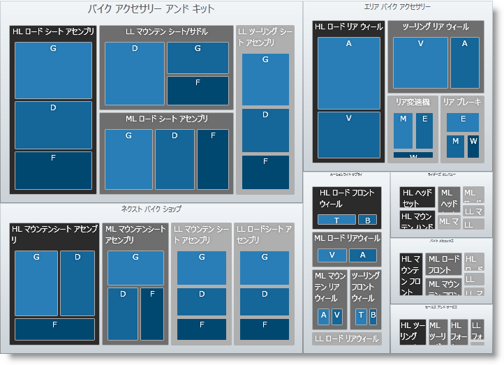

////

|metadata|
{
    "name": "xamtreemap-groupvaluemapper",
    "controlName": ["xamTreemap"],
    "tags": ["How Do I"],
    "guid": "330f37ef-152b-43f4-966f-98fa22982aa9",  
    "buildFlags": [],
    "createdOn": "2016-05-25T18:21:59.8473902Z"
}
|metadata|
////

= GroupValueMapper

link:{ApiPlatform}controls.charts.xamtreemap{ApiVersion}~infragistics.controls.charts.groupvaluemapper.html[GroupValueMapper] は、指定した値によって (たとえば StandardCost)、xamTreemap コントロールのノードをグループ化します。同様なノードに同じグループ値があります。

== GroupValueMapper プロパティ

* link:{ApiPlatform}controls.charts.xamtreemap{ApiVersion}~infragistics.controls.charts.valuemapper~valuepath.html[ValuePath] - データを含むデータ ソースのプロパティ名を決定します。
* link:{ApiPlatform}controls.charts.xamtreemap{ApiVersion}~infragistics.controls.charts.valuemapper~valuetypename.html[ValueTypeName] - ValuePath によって指定されるデータを含むフィールドを持つタイプの名前を決定します。
* link:{ApiPlatform}controls.charts.xamtreemap{ApiVersion}~infragistics.controls.charts.valuemapper~targetproperty.html[TargetProperty] - グループ マッピングによって影響を受けるプロパティを決定します。
* link:{ApiPlatform}controls.charts.xamtreemap{ApiVersion}~infragistics.controls.charts.valuemapper~targetname.html[TargetName] - xamTreemap コントロールのノードにカスタム テンプレートが定義されていて、名前付きの要素がある場合、この要素を指定するために TargetName を使用できます。
* link:{ApiPlatform}controls.charts.xamtreemap{ApiVersion}~infragistics.controls.charts.valuemapper~mappingmode.html[MappingMode] - カラー マッピングによって影響を受けるノードを決定します。可能となる値は "AllNodes" と "LeafNodesOnly" です。
* link:{ApiPlatform}controls.charts.xamtreemap{ApiVersion}~infragistics.controls.charts.groupvaluemapper~groupvalues.html[GroupValues] - これは同様のオブジェクトが取得する値のコレクションです。
* link:{ApiPlatform}controls.charts.xamtreemap{ApiVersion}~infragistics.controls.charts.groupvaluemapper~order.html[Order] - Ascending と Descending という 2 つの値を取得する列挙体。グループ値がマップされる順序に影響します。デフォルトの昇順の動作は、最小値を持つ要素に最初のグループ値を、最大値を持つ要素に最後のグループ値をマップします。

== 例

Manufacturer、Product および InventoryEntry という ３ つのクラスがあります。Product クラスには double フィールド StandardCost があります。Manufacturer クラスには整数フィールド Revenue があります。InventoryEntry クラスには整数フィールド Quantity があります。

*XAML の場合:*

----
<ig:xamTreemap.ValueMappers>
    <ig:GroupValueMapper 
        ValueTypeName="Manufacturer"
        ValuePath="Revenue"
        TargetProperty="FontSize"
        MappingMode="AllNodes"
        Order="Descending">
        <ig:GroupValueMapper.GroupValues>
            <System:Double>15</System:Double>
            <System:Double>10</System:Double>
            <System:Double>5</System:Double>
        </ig:GroupValueMapper.GroupValues>
    </ig:GroupValueMapper>
    <ig:GroupValueMapper 
        ValueTypeName="Product"
        ValuePath="StandardCost"
        TargetProperty="Fill"
        MappingMode="AllNodes">
        <ig:GroupValueMapper.GroupValues>
            <SolidColorBrush Color="#014871" />
            <SolidColorBrush Color="#156699" />
            <SolidColorBrush Color="#297eb7" />
        </ig:GroupValueMapper.GroupValues>
    </ig:GroupValueMapper>
    <ig:GroupValueMapper 
        ValueTypeName="InventoryEntry"
        ValuePath="Quantity"
        TargetProperty="Fill"
        MappingMode="AllNodes">
        <ig:GroupValueMapper.GroupValues>
            <SolidColorBrush Color="#430f52" />
            <SolidColorBrush Color="#601774" />
            <SolidColorBrush Color="#7d1f97" />
        </ig:GroupValueMapper.GroupValues>
    </ig:GroupValueMapper>
</ig:xamTreemap.ValueMappers>
----

 

== どのように動作するのか

最初のマッパーは、Revenue に基づいてタイプ Manufacturer のノードを 3 つのグループに分割します。各グループのノードはフォント サイズがグループに対応する値に設定されます。

2 番目のマッパーは、StandardCost に基づいてタイプ Product のノードを 3 つのグループに分割します。各グループのノードは塗りつぶしがグループに対応するブラシに設定されます。

3 番目のマッパーは、Quantity に基づいてタイプ InventoryEntry のノードを 3 つのグループに分割します。各グループのノードは塗りつぶしがグループに対応するブラシに設定されます。

関連トピック

link:xamtreemap-node-binders.html[ノード バインダー]

link:xamtreemap-value-mappers.html[値のマッパー]