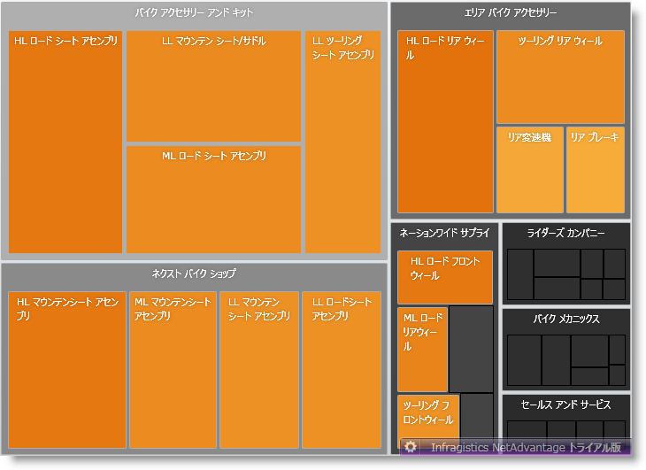
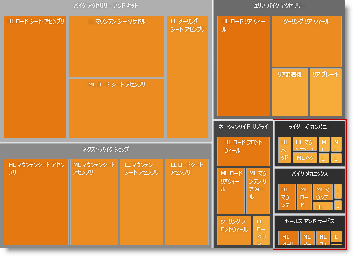

////

|metadata|
{
    "name": "xamtreemap-item-minimum-size",
    "controlName": ["xamTreemap"],
    "tags": ["How Do I"],
    "guid": "4d311f3b-4526-4d6b-b504-f5cd34e2a0a4",  
    "buildFlags": [],
    "createdOn": "2016-05-25T18:21:59.816419Z"
}
|metadata|
////

= 項目の最小サイズ

== 始める前に

xamTreemap コントロールが階層データを表示する時、表示されるのに十分な大きさでないノードが存在する可能性があります。

小さいノードに注意します。

link:{ApiPlatform}controls.charts.xamtreemap{ApiVersion}~infragistics.controls.charts.xamtreemap~itemminsize.html[ItemMinSize] プロパティは、ノードのサイズの最小値を設定します。ノードの幅または高さが ItemMinSize より小さい場合、ノードは UIElement の代わりに透明な画像として描画されます。

== ItemMinSize プロパティの設定

*XAML の場合:*

----
<ig:xamTreemap x:Name="Treemap" ItemMinSize="56" >
----

*Visual Basic の場合:*

----
Treemap.ItemMinSize = 56
----

*C# の場合:*

----
Treemap.ItemMinSize = 56;
----

 