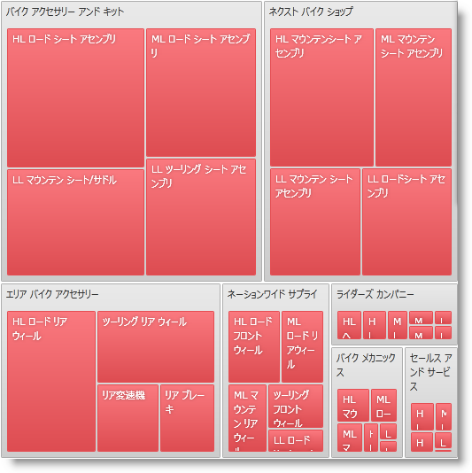
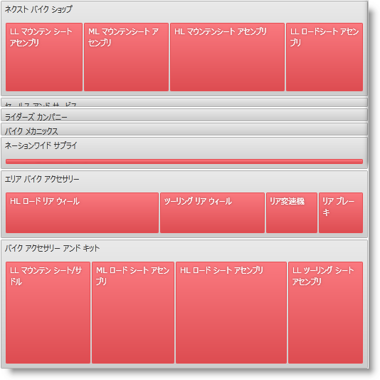
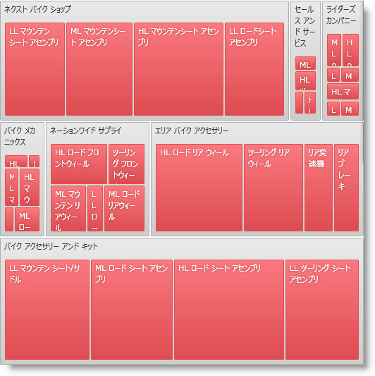
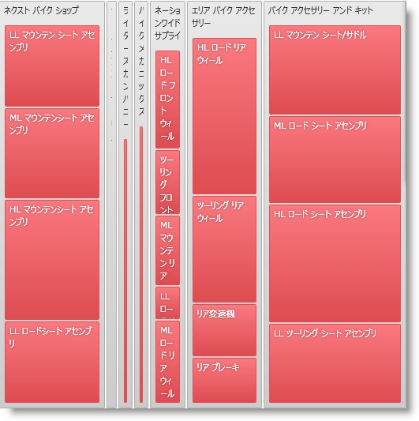

////

|metadata|
{
    "name": "xamtreemap-layouts",
    "controlName": ["xamTreemap"],
    "tags": ["Charting","How Do I","Layouts"],
    "guid": "6e6de661-6c31-4edb-8152-8c1fc03acde3",  
    "buildFlags": [],
    "createdOn": "2016-05-25T18:21:59.804418Z"
}
|metadata|
////

= レイアウト

== 詳細情報

このトピックでは、xamTreemap コントロールでデータのタイリングを担当する、プロパティ link:{ApiPlatform}controls.charts.xamtreemap{ApiVersion}~infragistics.controls.charts.xamtreemap~layouttype.html[LayoutType] と link:{ApiPlatform}controls.charts.xamtreemap{ApiVersion}~infragistics.controls.charts.xamtreemap~layoutorientation.html[LayoutOrientation] について学習します。

== レイアウトのタイプ

データを表示するようになる時にはさまざまなタイリング アルゴリズムがあります。すべてのアルゴリズムには、ユーザーのニーズに基づいて利点があります。一部は最高のアスペクト比、すなわちノードは可能な限り矩形に近い形を取得しようとします。他のアルゴリズムは、要素の内部順序を保持することを目的とします。データ ソース内で互いに近いオブジェクトはツリーマップで互いに近いところに配置されます。

xamTreemap コントロールのタイリング アルゴリズムは、LayoutType プロパティを通して設定されます。異なるレイアウトのタイプ:

* Squarified - このアルゴリズムは、最適な縦横比を描画しますが、オブジェクトがサイズによって並べ替えられます。

*XAML の場合:*

----
<ig:xamTreemap Name="myTreemap" LayoutType="Squarified" />
----

* SliceAndDice - このアルゴリズムは、縦横比を代わりに最初の順番を維持するようにします。

*XAML の場合:*

----
<ig:xamTreemap Name="myTreemap" LayoutType="SliceAndDice" />
----

* Strip - このタイルのアルゴリズムでは、SliceAndDice より縦横比がより正確で、Squarified より適切に並べ替えされます。

*XAML の場合:*

----
<ig:xamTreemap Name="myTreemap" LayoutType="Strip" />
----

xamTreemap コントロールの LayoutType プロパティのデフォルト値は Squarified です。

== レイアウトの方向

xamTreemap コントロールの LayoutOrientation プロパティによってユーザーは階層のノードが展開される方向を設定できます。

LayoutOrientation プロパティがレイアウト タイプ SliceAndDice および Strip と動作することに注意してください。

* Horizontal - 子ノードは水平に積み重ねられます (SliceAndDice)。

*XAML の場合:*

----
<ig:xamTreemap LayoutOrientation="Horizontal" LayoutType="SliceAndDice" />
----

* Vertical - 子ノードは垂直に積み重ねられます (SliceAndDice)。

*XAML の場合:*

----
<ig:xamTreemap LayoutOrientation="Vertical" LayoutType="SliceAndDice" />
----

