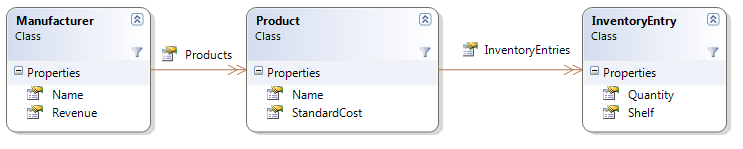
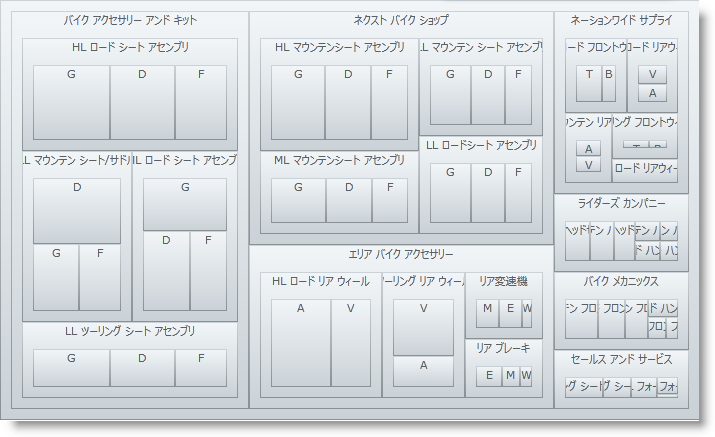

////

|metadata|
{
    "name": "xamtreemap-node-binders",
    "controlName": ["xamTreemap"],
    "tags": ["How Do I"],
    "guid": "3ced1457-0e02-47f0-9cc2-097d00dc4013",  
    "buildFlags": [],
    "createdOn": "2016-05-25T18:21:59.7903839Z"
}
|metadata|
////

= ノード バインダー

== 始める前に

データにバインドする時、xamTreemap コントロールはデータを理解することが必要です。これはノード バインダーで実行されます。

link:{ApiPlatform}controls.charts.xamtreemap{ApiVersion}~infragistics.controls.charts.nodebinder.html[NodeBinder] クラスには、以下のようなデータを読み取る方法を指示するプロパティがあります。

* link:{ApiPlatform}controls.charts.xamtreemap{ApiVersion}~infragistics.controls.charts.nodebinder~textpath.html[TextPath] - テキスト情報を含むデータ ソースのプロパティ名を決定します。
* link:{ApiPlatform}controls.charts.xamtreemap{ApiVersion}~infragistics.controls.charts.nodebinder~valuepath.html[ValuePath] - データを含むデータ ソースのプロパティ名を決定します。
* link:{ApiPlatform}controls.charts.xamtreemap{ApiVersion}~infragistics.controls.charts.nodebinder~targettypename.html[TargetTypeName] - ValuePath によってポイントされるデータのタイプを決定します。
* link:{ApiPlatform}controls.charts.xamtreemap{ApiVersion}~infragistics.controls.charts.nodebinder~itemssourcepath.html[ItemsSourcePath] - データ ソースが階層タイプの場合、ItemsSourcePath は子ノードをポイントするプロパティ名です。
* link:{ApiPlatform}controls.charts.xamtreemap{ApiVersion}~infragistics.controls.charts.nodebinder~nodestyle.html[NodeStyle] - NodeBinder がバインドするノードは NodeStyle プロパティによって指定されるスタイルを継承します。あらゆる NodeBinder は異なる NodeStyle を持つことができることに注意してください。

== 例

Manufacturer、Product および InventoryEntry というクラスがあります。Product クラスには InventoryEntry 項目のリストが含まれ、Manufacturer クラスには Product 項目が含まれます。

今度はデータ ソースから Manufacturer 項目のリストを表示するように xamTreemap コントロールを設定します。

コードは 3 つのノード バインダーを表示します。各バインダーはクラス (Manufacturer、Product および InventoryEntry) のひとつに適用されます。

*XAML の場合:*

----
<ig:xamTreemap.NodeBinders>
    <ig:NodeBinder 
        TargetTypeName="Manufacturer"
        ValuePath="Revenue" 
        TextPath="Name" 
        ItemsSourcePath="Products" />
    <ig:NodeBinder 
        TargetTypeName="Product" 
        ValuePath="StandardCost" 
        TextPath="Name" 
        ItemsSourcePath="InventoryEntries" />
    <ig:NodeBinder 
        TargetTypeName="InventoryEntry" 
        ValuePath="Quantity" 
        TextPath="Shelf" />
</ig:xamTreemap.NodeBinders>
----

関連トピック

link:xamtreemap-data-binding.html[データ バインディング]

link:xamtreemap-wpf-bind-xamtreemap-to-ado-net-entity-data-model.html[xamTreemap を ADO.NET Entity Data Model にバインド]