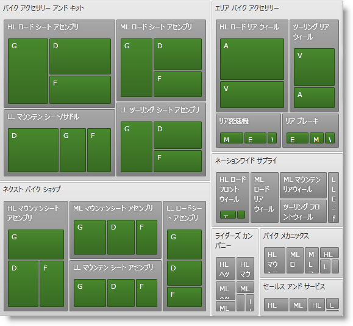
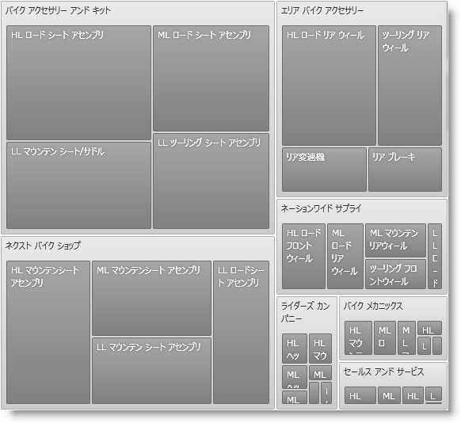
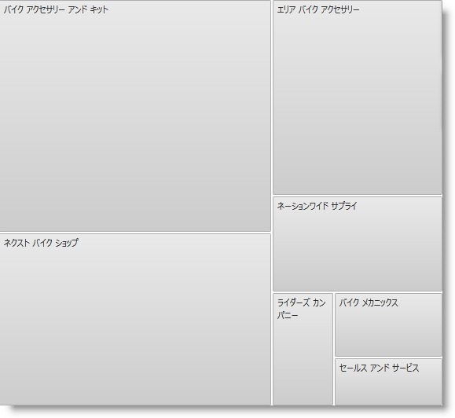

////

|metadata|
{
    "name": "xamtreemap-showing-depth",
    "controlName": ["xamTreemap"],
    "tags": ["How Do I"],
    "guid": "aaaf5c11-1f88-4f38-b688-339f3cabfa34",  
    "buildFlags": [],
    "createdOn": "2016-05-25T18:21:59.8104191Z"
}
|metadata|
////

= 表示深さ

xamTreemap コントロールの link:{ApiPlatform}controls.charts.xamtreemap{ApiVersion}~infragistics.controls.charts.xamtreemap~showingdepth.html[ShowingDepth] プロパティによってエンドユーザーは項目が表示される階層の深さの最大値を設定できます。

*XAML の場合:*

----
<ig:xamTreemap x:Name="Treemap" ShowingDepth="3" >
----

*XAML の場合:*

----
<ig:xamTreemap x:Name="Treemap" ShowingDepth="2" >
----

*XAML の場合:*

----
<ig:xamTreemap x:Name="Treemap" ShowingDepth="1" >
----

== 実際に表示している深さ

xamTreemap コントロールの link:{ApiPlatform}controls.charts.xamtreemap{ApiVersion}~infragistics.controls.charts.xamtreemap~actualshowingdepth.html[ActualShowingDepth] プロパティは実際に表示される階層レベルの最大値を指定します。カスタム ShowingDepth が設定される場合、ActualShowingDepth は常に ShowingDepth 以下の値に設定されます。

2 レベルの階層データ ソースが指定されており、ShowingDepth プロパティ値を 5 に設定する場合、ActualShowingDepth プロパティ値は 2 になります。