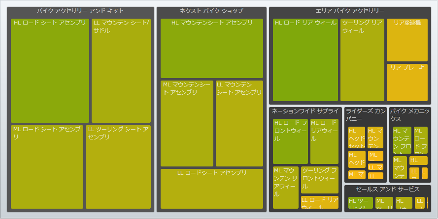

////

|metadata|
{
    "name": "xamtreemap-understanding-xamtreemap",
    "controlName": ["xamTreemap"],
    "tags": ["Charting","Getting Started","Summaries"],
    "guid": "9f2009f9-0e08-436f-982c-61375cdc6edb",  
    "buildFlags": [],
    "createdOn": "2016-05-25T18:21:59.739375Z"
}
|metadata|
////

= xamTreemap の理解

このセクションでは、xamTreemap コントロールの機能をより理解するために役立つ情報が見つかります。また、ノード バインダーや値マッパーについての詳細もあります。

link:xamtreemap-about-node-binding.html[xamTreemap ノード バインディングについて]

このトピックでは、データをバインドするために xamTreemap コントロールがノード バインダーをどのように使うかを学習します。

image::images/xamTreemap_Node_Binders_02.png[]

link:xamtreemap-about-value-mapping.html[xamTreemap 値マッパーについて]

このトピックでは、xamTreemap コントロールの値マッピング機能について説明します。

関連トピック

link:xamtreemap-getting-started-with-xamtreemap.html[xamTreemap を使用した作業の開始]

link:xamtreemap-using-xamtreemap.html[xamTreemap の使用]

link:xamtreemap-api-overview.html[API の概要]