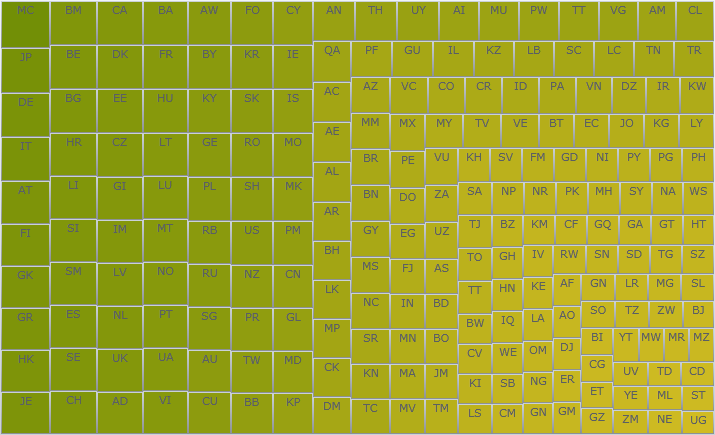

////

|metadata|
{
    "name": "xamtreemap",
    "controlName": ["xamTreemap"],
    "tags": ["Getting Started"],
    "guid": "258e0bea-5500-4e8e-a3ad-0e941a039455",  
    "buildFlags": [],
    "createdOn": "2016-05-25T18:21:59.9113933Z"
}
|metadata|
////

= xamTreemap

このセクションは、 link:{ApiPlatform}controls.charts.xamtreemap{ApiVersion}~infragistics.controls.charts.xamtreemap.html[xamTreemap] コントロールの使用に関する概要を提供します。このコントロールが実行することや、コントロールを使った共通タスクの実現方法の手順などの、様々な情報が含まれています。

以下のリンクをクリックして、xamTreemap コントロールに関する重要な情報にアクセスします。

== link:xamtreemap-understanding-xamtreemap.html[xamTreemap の理解]

Treemap は階層データをネストされるノードのセットとして表示します。ツリーの各ブランチにツリーマップ ノードを割り当てし、そのノードにサブブランチを表す小さいノードでタイルします。各ノードの矩形の領域のサイズはデータを指定した要素に相対します。データの別の要素を表すためにノードに色を設定することがあります。

色とサイズがツリー構造で対応している場合、他の手段でスポットするのが難しいパターンを容易に確認することができます。ツリーマップのもうひとつの利点は、スペースを効率的に使用できることです。結果として、画面で多くの項目を同時に読みやすく表示できます。

ツリーマップは、数量を示すように設計されていません。目的は相対的なランキングを示すことです。ツリーマップは、データ ポイントを分類したり、値の相対的な違いを伝達することが不得意である円チャートやエリア チャートの他のフォームよりも効果的です。

xamTreemap コントロールは、データの相対的な重みを表示するツリーマップです。さまざまなアルゴリズムを使用して、データ項目のレイアウトがどのように行われるかを決定する手助けをします。

* スライス ＆ ダイス (ディメンションの切り替え)
* 矩形
* Strip

xamTreemap コントロールによって、要件に最適なアルゴリズムを顧客は選択できます。Squarified メソッドを使用するようにデフォルト設定されています。このコントロールには、2 つのメカニズムを使用して顧客がノードに色付けすることができる機能が含まれています。最初のグループ ベースのメカニズムは、値で項目を色付けするもので、2 つ目はマップ choropleth に似ているもので、値に基づきノードの色にグラデーションを付けます。

このコントロールは、数多くのデータ ポイント ノードをバインドおよび描画することができます。

== link:xamtreemap-getting-started-with-xamtreemap.html[xamTreemap を使用した作業の開始]

xamTreemap コントロールを使ってすばやく起動して実行するためのコントロールの使用方法を提供します。

== link:xamtreemap-using-xamtreemap.html[xamTreemap の使用]

このセクションには、xamTreemap コントロールで提供される主要な特徴および機能に関する情報が含まれています。

== link:xamtreemap-api-overview.html[API の概要]

このトピックは、xamTreemap コントロールでプログラミングする間に作業をする名前空間とクラスをリストします。このトピックの名前空間とクラスの一覧は、{ProductName} ヘルプの link:api-reference-guide.html[API リファレンス ガイド]へリンクします。