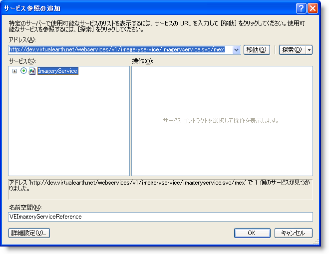

////
|metadata|
{
    "name": "xamwebmap-add-bing-maps-as-geo-imagery-data-source",
    "controlName": ["xamMap"],
    "tags": ["Application Scenarios","How Do I"],
    "guid": "{F0CD73AC-9D32-45AE-9690-BE543DB92600}",
    "buildFlags": [],
    "createdOn": "2016-05-25T18:21:57.0662629Z"
}
|metadata|
////

= Bing Maps へバインド

== 始める前に

xamMap コントロールは、 link:xamwebmap-supported-geo-imagery.html[サポートされる地図画像]セクションに記載されている多数の地図画像のソースをサポートします。このトピックでは、地理的画像データ ソースとして Bing Maps を使用する方法について説明します。link:{ApiPlatform}controls.maps.xammap{ApiVersion}~infragistics.controls.maps.xammap.html[xamMap] コントロールの link:{ApiPlatform}controls.maps.xammap{ApiVersion}~infragistics.controls.maps.xammap~maptilesource.html[MapTileSource] プロパティは、地図画像データを取得するために Microsoft の Bing Maps 画像サービスで使用されます。Bing Maps は Microsoft によってライセンスされている Web 地図サービスで、このトピックの以下の手順を続行する前に Microsoft の link:http://www.bingmapsportal.com[Web サイト]から Bing Maps Key キーを取得する必要があります。

== 達成すること

Bing Maps 地理的画像データをデータ ソースとして link:{ApiPlatform}controls.maps.xammap{ApiVersion}~infragistics.controls.maps.xammap.html[xamMap] コントロールに追加し、コントロールのウィンドウ地図座標を初期化します。

image::images/xamMap_Binding_Bing_Maps_01.png[]

== 以下の手順を実行します。

以下の指示は、xamMap コントロールのためにプロジェクトを設定済みで、Bing Maps 画像サービスのキーを取得していることが前提となります。

[start=1]
. Microsoft® {PlatformName}® プロジェクトを作成します。
[start=2]
. 以下の NuGet パッケージ参照をプロジェクトに追加します。

** Infragistics.WPF.Controls.Maps.XamMap

+
NuGet フィードのセットアップと NuGet パッケージの追加の詳細については、link:nuget-feeds.html[NuGet フィード] ドキュメントを参照してください。

[start=3]
. 以下の xamMap コントロールの名前空間宣言を追加します。

*XAML の場合:*

----
xmlns:ig="http://schemas.infragistics.com/xaml"
----

*Visual Basic の場合:*

----
Imports Infragistics.Controls.Maps
Imports Infragistics
----

*C# の場合:*

----
using Infragistics.Controls.Maps;
using Infragistics;
----

[start=4]
. xamMap コントロールをメインの XAML ファイルに追加します。

*XAML の場合:*

----
<ig:XamMap x:Name="igMap">
<!-- 注: ここで、シェープファイルなどを使用してさらに Map Layer オブジェクトを追加できます -->
</ig:XamMap>
----

注: 以下の手順は、Bing Maps 画像サービスから地図画像のタイルを取得するために xamMap コントロールの設定で必要となります。
[start=5]
. アプリケーション プロジェクトを右クリックし、[サービス参照の追加] をメニュー項目から選択します。

[start=6]
. [サービス参照の追加] ウィンドウで [詳細] ボタンをクリックします。

[start=7]
. [サービス参照設定] ウィンドウのクライアント セクションで [非同期操作を生成する] をチェックします。

[start=8]
. [サービス参照の追加] ウィンドウの [Web 参照の追加] ボタンをクリックします。

[start=9]
. 以下のアドレスを [URL] テキストボックスに入力して [移動] ボタンをクリックします。

link:http://dev.virtualearth.net/webservices/v1/imageryservice/imageryservice.svc/mex[http://dev.virtualearth.net/webservices/v1/imageryservice/imageryservice.svc/mex]

[start=10]
. [Web 参照名] テキストボックスに *BingImageryServiceReference* と入力し、[参照の追加] ボタンをクリックします。

[start=11]
. UserControl のコンストラクターで、UserControl の Loaded イベント用のハンドラーを追加して実装します。

*Visual Basic の場合:*

----
Private Sub UserControl_Loaded(ByVal sender As System.Object, ByVal e As System.Windows.RoutedEventArgs)
        InitImageryService()
        InitMapCoordinates()
End Sub
----

*C# の場合:*

----
private void UserControl_Loaded(object sender, RoutedEventArgs e)
{
        InitImageryService();
        InitMapCoordinates();
}
----

[start=12]
. 地図画像データを要求するために Bing Maps 画像サービスを初期化する以下のメソッドを追加します。

*Visual Basic の場合:*

----
Private Sub InitImageryService()
        Dim mapImgRequest As New BingImageryServiceReference.ImageryMetadataRequest()
        ' 注: Bing Maps の本人キーを提供する必要があります
        mapImgRequest.Credentials = New BingImageryServiceReference.Credentials()
        mapImgRequest.Credentials.ApplicationId = "BING_MAPS_SECRET_KEY"
        mapImgRequest.Style = BingImageryServiceReference.MapStyle.AerialWithLabels
        ' 地理的画像要求を処理するために非同期の Bing Maps サービスを作成します
        Dim imgService As New BingImageryServiceReference.ImageryServiceClient("BasicHttpBinding_IImageryService")
        AddHandler imgService.GetImageryMetadataCompleted, AddressOf OnImageryServiceGetImageryMetadataCompleted
        imgService.GetImageryMetadataAsync(mapUriRequest)
End Sub
----

*C# の場合:*

----
private void InitImageryService()
{
    BingImageryServiceReference.ImageryMetadataRequest mapImgRequest = new BingImageryServiceReference.ImageryMetadataRequest();
    // 注: Bing Maps の本人キーを提供する必要があります
    mapImgRequest.Credentials = new BingImageryServiceReference.Credentials();
    mapImgRequest.Credentials.ApplicationId = "BING_MAPS_SECRET_KEY";
    mapImgRequest.Style = BingImageryServiceReference.MapStyle.AerialWithLabels;
    // 地理的画像要求を処理するために非同期の Bing Maps サービスを作成します
    BingImageryServiceReference.ImageryServiceClient imgService = new BingImageryServiceReference.ImageryServiceClient("BasicHttpBinding_IImageryService");
    imgService.GetImageryMetadataCompleted += OnImageryServiceGetImageryMetadataCompleted;
    imgService.GetImageryMetadataAsync(mapImgRequest);
}
----

[start=13]
. 地理的画像の要求を処理し、xamMap コントロールで地理的画像を表示するために以下のメソッドを追加します。

*Visual Basic の場合:*

----
Private Sub OnImageryServiceGetImageryMetadataCompleted(ByVal sender As Object, ByVal e As BingImageryServiceReference.GetImageryMetadataCompletedEventArgs)
        Dim result As BingImageryServiceReference.ImageryMetadataResult = e.Result.Results(0)
        Dim source As New Infragistics.Controls.Maps.BingMapsTileSource()
        source.TilePath = result.ImageUri
        source.SubDomains = New ObservableCollection(Of String)(result.ImageUriSubdomains)
        igMap.MapTileSource = source
End Sub
----

*C# の場合:*

----
private void OnImageryServiceGetImageryMetadataCompleted(object sender, BingImageryServiceReference.GetImageryMetadataCompletedEventArgs e)
{
        BingImageryServiceReference.ImageryMetadataResult result = e.Result.Results[0];
        igMap.MapTileSource = newInfragistics.Controls.Maps.BingMapsTileSource()
        {
                TilePath = result.ImageUri,
                SubDomains = new ObservableCollection<string>(result.ImageUriSubdomains)
        };
}
----

[start=14]
. xamMap コントロールの世界地図座標を初期化するために以下のメソッドを追加します。

*Visual Basic の場合:*

----
Private Sub InitMapCoordinates()
        ' 世界のサイズを定義します
        Dim worldTopLeft As Point = New Point(-180, 90)
        Dim worldBottomRight As Point = New Point(180, -90)
        ' 測地座標をデカルト座標に変換します
        Dim winTopLeft As Point = Me.xamMap.MapProjection.ProjectToMap(worldTopLeft)
        Dim winBottomRight As Point = Me.xamMap.MapProjection.ProjectToMap(worldBottomRight)
        ' Rect 構造、地図コントロールの WindowRect および WorldRect を作成します
        Dim winRect As New Rect()
        winRect.X = Math.Min(winTopLeft.X, winBottomRight.X)
        winRect.Y = Math.Min(winTopLeft.Y, winBottomRight.Y)
        winRect.Width = Math.Abs(winTopLeft.X - winBottomRight.X)
        winRect.Height = Math.Abs(winTopLeft.Y - winBottomRight.Y)
        Me.igMap.IsAutoWorldRect = False
        Me.igMap.WindowZoomMaximum = 80
        ' 地図コントロールの WindowRect および WorldRect を変更します
        Me.igMap.WorldRect = winRect
        Me.igMap.WindowRect = winRect
End Sub
----

*C# の場合:*

----
private void InitMapCoordinates()
{
        // 世界のサイズを定義します 
       Point worldTopLeft = new Point(-180, 90);
       Point worldBottomRight = new Point(180, -90);
       // 測地座標をデカルト座標に変換します
       Point winTopLeft = this.igMap.MapProjection.ProjectToMap(worldTopLeft);
       Point winBottomRight = this.igMap.MapProjection.ProjectToMap(worldBottomRight);
       // Rect 構造、地図コントロールの WindowRect および WorldRect を作成します
       Rect winRect = new Rect()
       {
        X = Math.Min(winTopLeft.X, winBottomRight.X),
        Y = Math.Min(winTopLeft.Y, winBottomRight.Y),
        Width = Math.Abs(winTopLeft.X - winBottomRight.X),
        Height = Math.Abs(winTopLeft.Y - winBottomRight.Y)
       };
       this.igMap.IsAutoWorldRect = false;
       this.igMap.WindowZoomMaximum = 80;
       // 地図コントロールの WindowRect および WorldRect を変更します
       this.igMap.WindowRect = this.igMap.WorldRect = winRect;
}
----

[start=15]
. プロジェクトを保存して実行します。xamMap コントロールは、Bing Maps ソースから地理的画像データをロードし表示します。以下のスクリーンショットはその結果を示します。

image::images/xamMap_Binding_Bing_Maps_01.png[]

== 関連トピック

link:xamwebmap-merge-bing-maps-with-shapefile.html[Bing Maps をシェープファイルと結合]

link:xamwebmap-supported-geo-imagery.html[サポートされる地図画像]

link:xamwebmap-add-open-street-maps-as-geo-imagery-data-source.html[Open Street Maps へバインド]