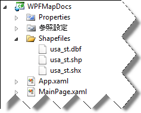

////
|metadata|
{
    "name": "xamwebmap-display-map-accessdata-using-shapefiles",
    "controlName": ["xamMap"],
    "tags": ["Data Presentation","How Do I"],
    "guid": "1fa759f3-d5ce-47c0-afd9-9715096d82f7",
    "buildFlags": [],
    "createdOn": "2016-05-25T18:21:57.3172392Z"
}
|metadata|
////

= シェープファイルをバインド

== 始める前に

xamMap コントロールはシェープファイルから派生した情報を表示します。たとえば、シェープファイルが米国マップの情報を含む場合、xamMap はこのマップを表示します。シェープファイル形式と構成の詳細は、 link:xamwebmap-understanding-xamwebmap.html[「xamMap について]を参照してください。

== 達成すること

米国のマップを表示するように xamMap コントロールを設定します。

== 次の手順を実行します

[start=1]
. Microsoft® {PlatformName}® プロジェクトを作成します。
[start=2]
. 以下の NuGet パッケージ参照をプロジェクトに追加します。

** Infragistics.WPF.Controls.Maps.XamMap

+
NuGet フィードのセットアップと NuGet パッケージの追加の詳細については、link:nuget-feeds.html[NuGet フィード] ドキュメントを参照してください。

[start=3]
. 以下の xamMap コントロールの名前空間宣言を追加します。

*XAML の場合:*

----
xmlns:igMap="http://schemas.infragistics.com/xaml"
----

*Visual Basic の場合:*

----
Imports Infragistics.Controls.Maps
Imports Infragistics
----

*C# の場合:*

----
using Infragistics.Controls.Maps;
using Infragistics;
----

[start=4]

. "Shapefiles" と呼ばれるサブフォルダーにプロジェクトに使用しようとするシェープファイルを追加します。xamMap コントロールの ShapeFileReader は、ハードディスクの場所に関係なくシェープファイルを開くことができます。これは、絶対パスを使用してアーカイブされます (たとえば、"C:\Data\YourShapefileName")。シェープファイルをプロジェクトにも含むことができます。

この場合、相対パスでファイルを指定できます。実行ファイルは "ProjectPath\bin\Debug\" フォルダーに配置されるので、画像では "/../../ShapeFiles/usa_st" となります。
[start=5]
. xamMap コントロールをプロジェクトに追加します。

*XAML の場合:*

----
<igMap:XamMap x:Name="xamMap">
   <!-- TODO: マップ レイヤーを追加します -->            
</igMap:XamMap>
----

*Visual Basic の場合:*

----
Dim xamMap As New xamMap()
Me.LayoutRoot.Children.Add(xamMap)
----

*C# の場合:*

----
XamMap xamMap = new xamMap();
this.LayoutRoot.Children.Add(xamMap);
----

[start=6]
. シェープファイルからの情報を表示するために link:{ApiPlatform}controls.maps.xammap{ApiVersion}~infragistics.controls.maps.maplayer.html[MapLayer] オブジェクトを作成します。

*XAML の場合:*

----
<igMap:XamMap.Layers>
   <igMap:MapLayer x:Name="statesLayer">
      <!-- TODO: シェープファイルを読み取ります -->
   </igMap:MapLayer>
</igMap:XamMap.Layers>
----

*Visual Basic の場合:*

----
Dim statesLayer As New MapLayer()
xamMap.Layers.Add(statesLayer)
----

*C# の場合:*

----
MapLayer statesLayer = new MapLayer();
xamMap.Layers.Add(statesLayer);
----

[start=7]
. link:{ApiPlatform}controls.maps.xammap{ApiVersion}~infragistics.controls.maps.shapefilereader.html[ShapeFileReader] オブジェクトを作成して、シェープファイルから情報を読み取り、希望のデータ マッピングを実行します。

*XAML の場合:*

[source]
----
<igMap:MapLayer.Reader>
   <igMap:ShapeFileReader Uri="/../../Shapefiles/usa_st"
----

[source]
----
DataMapping="Caption=STATE_ABBR" />
</igMap:MapLayer.Reader>
----

*Visual Basic の場合:*

----
Dim reader As New ShapeFileReader()
reader.Uri = "Shapefiles/usa_st/../../ShapeFiles/usa_st"
Dim converter As New DataMapping.Converter()
reader.DataMapping = TryCast(converter.ConvertFromString("Caption=STATE_ABBR"), DataMapping)
statesLayer.Reader = reader
----

*C# の場合:*

[source]
----
ShapeFileReader reader = new ShapeFileReader();
reader.Uri = "Shapefiles/usa_st/../../ShapeFiles/usa_st";
DataMapping.Converter converter = new DataMapping.Converter();
reader.DataMapping = converter.ConvertFromString("Caption=STATE_ABBR") as
DataMapping;
statesLayer.Reader = reader;
----

[start=8]
. アプリケーションを実行します。xamMap コントロールはシェープファイル データを使用して米国のマップを表示します。

image::images/SL_DV_XamMap_Displaying_XamMap_Using_Shapefiles_02.png[]