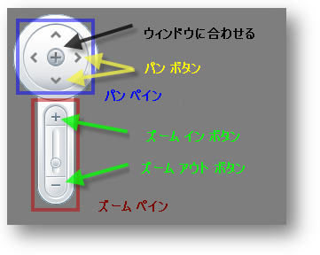

////

|metadata|
{
    "name": "xamwebmap-map-panes",
    "controlName": ["xamMap"],
    "tags": [],
    "guid": "{05F54E15-055D-4340-B162-4277A6BEB0F8}",  
    "buildFlags": [],
    "createdOn": "2016-05-25T18:21:57.2532752Z"
}
|metadata|
////

= マップ ペインの表示

このセクションは、Map ペインに関する重要な概念およびタスクベース情報を提供します。

== ナビゲーション ペインの表示

xamMap の link:{ApiPlatform}controls.maps.xammap{ApiVersion}~infragistics.controls.maps.mapnavigationpane.html[MapNavigationPane] オブジェクトは、コントロールのビューポート内でのナビゲーションのために使用されます。パン ペインとズーム ペインで構成されます。パン ペインは、マップの領域を移動するためのボタンを含んでいますが、ズーム ペインはズーム インおよびズームアウトのためのスライダー バーを含んでいます。

[NOTE]
====
注: xamMap で任意のペインを使用する時に、コントロールの側面にドッキングしたい場合があります。xamMap コントロールはコントロールをレイアウトするためにデフォルトで xamDock パネルを使用します。xamDock の添付プロパティを設定する必要がある場合、Infragistics.Controls. 名前空間が含まれていることを確認してください。
====

ドック パネルの内部および右端にナビゲーション ペインを表示するために、以下のコードを使用します:

*XAML の場合:*

----
xmlns:ig="http://schemas.infragistics.com/xaml"
<!-- ...-->
<ig:XamMap x:Name="xamMap" >
        <ig:MapNavigationPane ig:XamDock.Edge="InsideRight" Margin="10"/>
</ig:XamMap>
----

*Visual Basic の場合:*

----
' ナビゲーション ペイン コントロールの追加 
Dim navPane As New MapNavigationPane()
navPane.SetValue(XamDock.EdgeProperty, DockEdge.InsideRight)
navPane.Margin = New Thickness(10)
xamMap.LogicalChildren.Add(navPane)
----

*C# の場合:*

----
// ナビゲーション ペイン コントロールの追加 
MapNavigationPane navPane = new MapNavigationPane();
navPane.SetValue(XamDock.EdgeProperty, DockEdge.InsideRight);
navPane.Margin = new Thickness(10);
xamMap.LogicalChildren.Add(navPane);
----

image::images/xamMap_Map_Panes_02.png[]

== サムネイル ペインを表示

link:{ApiPlatform}controls.maps.xammap{ApiVersion}~infragistics.controls.maps.mapthumbnailpane.html[MapThumbnailPane] ペインはエンド ユーザーが XamMap ビューポートを通して大きいマップをナビゲートする手助けをします。サムネイル ペインは、マップのどのどの部分が現在表示可能かを表す小さい矩形とともにマップ全体のサムネイルを表示できます。エンド ユーザーはサムネイル ペインでこの矩形をクリックして移動し、ビューポート内にマップ部分を効果的に表示できます。

Thumbnail Pane のためにデフォルトで作成される画像はありません。サムネイル画像を持つスタイルを作成して固有の画像を提供し、 link:{ApiPlatform}controls.maps.xammap{ApiVersion}~infragistics.controls.maps.mapthumbnailpane~worldstyle.html[WorldStyle] プロパティにそのスタイルを指定することができます。

以下のコードは XamMap でサムネイル画像を持つサムネイル ペインを表示する方法を示します。

[NOTE]
====
注: xamMap で任意のペインを使用する時に、コントロールの側面にドッキングしたい場合があります。xamMap コントロールはコントロールをレイアウトするためにデフォルトで xamDock パネルを使用します。xamDock の添付プロパティを設定する必要がある場合、Infragistics.Controls. 名前空間が含まれていることを確認してください。
====

*XAML の場合:*

----
xmlns:ig="http://schemas.infragistics.com/xaml"
<!-- ...-->
<ig:MapThumbnailPane ig:XamDock.Edge="InsideBottom" Width="300" Height="150">
   <ig:MapThumbnailPane.WorldStyle>
      
   </ig:MapThumbnailPane.WorldStyle>        
</ig:MapThumbnailPane>
----

*Visual Basic の場合:*

----
Dim thumbnailPane As New MapThumbnailPane()
thumbnailPane.SetValue(XamDock.EdgeProperty, DockEdge.InsideBottom)
thumbnailPane.Width = 300
thumbnailPane.Height = 150
Dim imageSource As New BitmapImage()
imageSource.UriSource = New Uri("tinyWorld.png", UriKind.Relative)
Dim b As New ImageBrush()
b.ImageSource = imageSource
Dim worldStyle As New Style(GetType(Path))
worldStyle.Setters.Add(New Setter(Path.FillProperty, b))
thumbnailPane.WorldStyle = worldStyle
xamMap.LogicalChildren.Add(thumbnailPane)
----

*C# の場合:*

----
MapThumbnailPane thumbnailPane = new MapThumbnailPane();
thumbnailPane.SetValue(XamDock.EdgeProperty, DockEdge.InsideBottom);
thumbnailPane.Width = 300;
thumbnailPane.Height = 150;
BitmapImage imageSource = new BitmapImage();
imageSource.UriSource = new Uri("tinyWorld.png", UriKind.Relative);
ImageBrush b = new ImageBrush();
b.ImageSource = imageSource;
Style worldStyle = new Style(typeof(Path));
worldStyle.Setters.Add(new Setter(Path.FillProperty, b));
thumbnailPane.WorldStyle = worldStyle;
xamMap.LogicalChildren.Add(thumbnailPane);
----

image::images/xamMap_Map_Panes_03.png[]

== スケール ペインの表示

link:{ApiPlatform}controls.maps.xammap{ApiVersion}~infragistics.controls.maps.mapscalepane.html[MapScalePane] はコントロールの現在の倍率に関係して xamMap にサンプルの距離を表示します。エンド ユーザーがズームインおよびズームアウトすると、スケール ペインはサンプルの距離を更新します。

link:{ApiPlatform}controls.maps.xammap{ApiVersion}~infragistics.controls.maps.mapscalepane~ismetric.html[IsMetric] プロパティまたは link:{ApiPlatform}controls.maps.xammap{ApiVersion}~infragistics.controls.maps.mapscalepane~isimperial.html[IsImperial] プロパティを設定することによって測定の単位を指定できます。

[NOTE]
====
注: xamMap で任意のペインを使用する時に、コントロールの側面にドッキングしたい場合があります。xamMap コントロールはコントロールをレイアウトするためにデフォルトで xamDock パネルを使用します。xamDock の添付プロパティを設定する必要がある場合、Infragistics.Controls. 名前空間が含まれていることを確認してください。
====

ドック パネルの内部および上端にスケール ペインを表示するために、以下のコードを使用します:

*XAML の場合:*

----
xmlns:ig="http://schemas.infragistics.com/xaml"
<!-- ...-->
<ig:MapScalePane ig:XamDock.Edge="InsideTop" Width="200" />
----

*Visual Basic の場合:*

----
' スケール ペイン コントロールの追加 
Dim scalePane As New MapScalePane()
scalePane.SetValue(XamDock.EdgeProperty, DockEdge.InsideTop)
scalePane.Width = 200
xamMap.LogicalChildren.Add(scalePane)
----

*C# の場合:*

----
//スケール ペイン コントロールの追加 
MapScalePane scalePane = new MapScalePane();
scalePane.SetValue(XamDock.EdgeProperty, DockEdge.InsideTop);
scalePane.Width = 200;
xamMap.LogicalChildren.Add(scalePane);
----

image::images/xamMap_Map_Panes_04.png[]