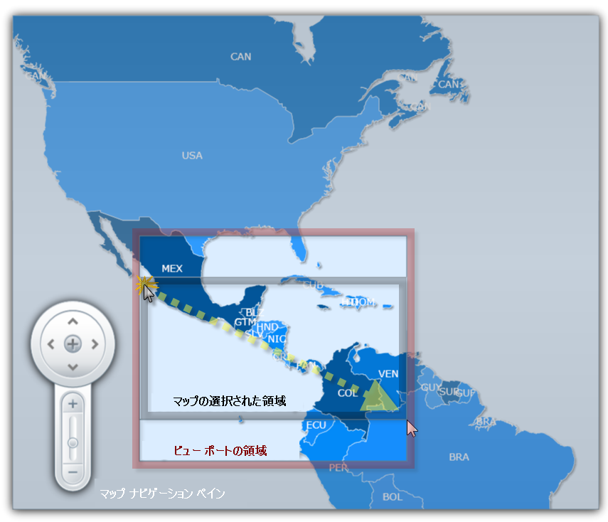

////

|metadata|
{
    "name": "xamwebmap-understanding-xamwebmap",
    "controlName": ["xamMap"],
    "tags": ["Application Scenarios","Data Presentation","How Do I"],
    "guid": "{457D9D23-1408-4D21-968E-3337563B98C1}",  
    "buildFlags": [],
    "createdOn": "2016-05-25T18:21:57.2652755Z"
}
|metadata|
////

= xamMap について

ここでは、 link:{ApiPlatform}controls.maps.xammap{ApiVersion}~infragistics.controls.maps.xammap.html[xamMap] コントロール、およびその主要な特性と機能について解説しています。このセクションのトピックを読むと、アプリケーションで xamMap を使用することの利点を理解できます。

== データ マッピング

xamMap のデータ マッピングによって、 link:{ApiPlatform}controls.maps.xammap{ApiVersion}~infragistics.controls.maps.mapelement.html[MapElement] プロパティをデータソースの値にバインドすることができます。これを実行するには、 link:{ApiPlatform}controls.maps.xammap{ApiVersion}~infragistics.controls.maps.shapefilereader.html[ShapeFileReader] を使用して Shapefile を読み取る前に、そのリーダーの link:{ApiPlatform}controls.maps.xammap{ApiVersion}~infragistics.controls.maps.reader~datamapping.html[DataMapping] プロパティを設定する必要があります。

DataMapping プロパティは、セミコロンで区切られたキーと値の組み合わせの文字列を取ります。トークンは大文字と小文字を識別し、マップされる列とプロパティを決定します。以下はデータ マップの例で、米国の州の Shapefile が提供されています:

ifdef::wpf[]

*XAML の場合:*

----
<igMap:ShapeFileReader Uri="/../../Shapefiles/usa_st" DataMapping="Caption=STATE_ABBR" />
----

endif::wpf[]

この例はマップ要素の link:{ApiPlatform}controls.maps.xammap{ApiVersion}~infragistics.controls.maps.mapelement~caption.html[Caption] プロパティを Shapefile からの STATE_ABBR 列のデータにバインドします。表示するのは米国の州のマップで、各州は短縮形の州名のキャプションを表示します。

列のデータをエレメントの任意のプロパティに保存することも可能です:

ifdef::wpf[]

*XAML の場合:*

----
<igMap:ShapeFileReader Uri="/../../Shapefiles/usa_st" DataMapping="STATE_ABBREVIATIONS=STATE_ABBR"/>
----

endif::wpf[]

この XAML スニペットは STATE_ABBR 列のデータをエレメントごとに STATE_ABBREVIATIONS という名前のプロパティに保存します。データ マッピングを指定しない場合、xamMap が Shapefile を読み取る時に、すべてのデータ列は列と同じ名前の各要素の任意のプロパティにマップされます。プロパティ名を要素の link:{ApiPlatform}controls.maps.xammap{ApiVersion}~infragistics.controls.maps.mapelement~getproperty.html[GetProperty] メソッドに渡すことによってプロパティにアクセスできます。たとえば、明示的なデータ マッピングが設定されていない場合、"STATE_ABBR" を渡すと個々のエレメントの州名の短縮形を取得します。link:{ApiPlatform}controls.maps.xammap{ApiVersion}~infragistics.controls.maps.mapelement~setproperty.html[SetProperty] メソッドを使用して設定するプロパティ名と値を渡すことによってプロパティを設定することも可能です。

== シェープファイル

xamMap コントロールは、マップ データのソースとして一般的な link:http://en.wikipedia.org/wiki/Shapefile#Overview[Shapefile] フォーマットを使用します。Shapefile は、点、線分群、多角形を記述する地理空間ベクトル データ フォーマットです。Shapefile は一般的にファイルの集合を指し、一般的な接頭辞名、たとえば "states" を使用する場合、拡張子 ".shp"、".shx"、および ".dbf" が通常付きます。

xamMap コントロールは Shapefile に基づいて異なりますが、都市、道路、州などの点、線分群、多角形ベクトル データを表示できます。このコントロールは、シェープファイルごとにレイヤーを 1 つ使用します。

== マップ レイヤー

link:{ApiPlatform}controls.maps.xammap{ApiVersion}~infragistics.controls.maps.maplayer.html[MapLayer] オブジェクトは xamMap で Shapefile データを表示するための方法です。複数のレイヤーを使用することによって複数の Shapefile を表示できます。

Shapefile のコンテンツを読み取りレイヤーにコンテンツを表示するために link:{ApiPlatform}controls.maps.xammap{ApiVersion}~infragistics.controls.maps.shapefilereader.html[ShapeFileReader] オブジェクトを使用できます。Shapefile は Web プロジェクトの ClientBin フォルダーに配置する必要があります。さらに、より多くの情報を表示するために Shapefile のデータとマップのエレメントのプロパティ間のデータ マッピングを実行することができます。

Shapefile の読み取りとデータ マッピングの使用に関する詳細は、 link:xamwebmap-display-map-using-shapefiles.html[シェープファイルをバインド]を参照してください。

== マップ要素

マップ要素は特定のレイヤーで図形、線、多角形を表します。xamMap によって表示される図形を操作する方法を提供します。マップ要素はこれらの要素が存在するレイヤーからプロパティを取得します。これらのプロパティは個々に設定することも可能です。マップ 要素の詳細は、 link:xamwebmap-map-elements.html[マップ要素の表示]を参照してください。

== 地図レイアウト

xamMap コントロールは子コントロール、ペイン、および図形矩形のコンテナーとして機能します。これらの要素は一緒にになってマップの視覚的表現を構成するのに役立ちます。

== マップ ペイン

以下は xamMap で使用可能なペインのリストです:

[start=1]
. link:{ApiPlatform}controls.maps.xammap{ApiVersion}~infragistics.controls.maps.mapscalepane.html[MapScalePane]
[start=2]
. link:{ApiPlatform}controls.maps.xammap{ApiVersion}~infragistics.controls.maps.mapcolorswatchpane.html[MapColorSwatchPane]
[start=3]
. link:{ApiPlatform}controls.maps.xammap{ApiVersion}~infragistics.controls.maps.mapnavigationpane.html[MapNavigationPane]
[start=4]
. link:{ApiPlatform}controls.maps.xammap{ApiVersion}~infragistics.controls.maps.mapthumbnailpane.html[MapThumbnailPane]

image::images/xamMap_Map_Layout_01.png[]

これらの異なる要素をレイアウトするために、xamMap はそれぞれマップの本体のコンテンツを定義し、コントロールの位置を指定するためにレイヤーのコレクションと xamDock パネルを含んでいます。

マップの子が Layers コレクションに配置されない場合、LogicalChildren にルートされ、xamDock コントロールの子として描画されます。そのようなものとして、ドック位置は xamDock.Edge 添付プロパティを使用して設定できます。

マップ レイヤーおよびそれらのすべての要素は、コントロール領域の中央にドックされるマップビューポート内に含まれます。

== マップ ビュー ポート

ビューポートはマップの表示可能な領域で、マップ空間データを表示するために予約されています。ビューポートは以下の機能があります:

* パンニング、ズーム、フィットのための組み込みキーボード ナビゲーション
* ドラッグ パンニング、プレビューによる領域ズーム、および領域選択のための組み込みマウス ナビゲーション

== マップ ナビゲーション

xamMap コントロールによって、コンテンツのパンとズームが可能となります。これは多数の方法で実行できます:

[start=1]
. 組み込みキーボード ナビゲーション。

[options="header", cols="a,a"]
|====
|作業|説明

|パンニング
|矢印キー

|ズーム
|Page Up および Page Down キー

|フィット
|Home キー

|====

[start=2]
. 組み込みマウス ナビゲーション。

[options="header", cols="a,a"]
|====
|作業|説明

|パンニング
|マウス ドラッグ

|ズーム
|マウス スクロール

|領域ズーム
|Shift + マウス ドラッグ

|====

[start=3]
. ナビゲーション ペイン。詳細について、 link:xamwebmap-navigate-geo-imagery-map.html[地図画像マップをナビゲート]を参照してください。

link:{ApiPlatform}controls.maps.xammap{ApiVersion}~infragistics.controls.maps.xammap~ispannable.html[IsPannable] および link:{ApiPlatform}controls.maps.xammap{ApiVersion}~infragistics.controls.maps.xammap~iszoomable.html[IsZoomable] ブール値プロパティを使用してパンとズームを制限することができます。

== ズーム

link:{ApiPlatform}controls.maps.xammap{ApiVersion}~infragistics.controls.maps.xammap~windowscale.html[WindowScale] プロパティで表現される xamMap コントロールのウィンドウ スケールを増すことでズームが機能します。ウィンドウ スケールの増減の係数は、 link:{ApiPlatform}controls.maps.xammap{ApiVersion}~infragistics.controls.maps.xammap~windowzoombase.html[WindowZoomBase] プロパティによって制御されます。デフォルトでは、このプロパティは 1.3 の値を持ちます。ズーム レベルを 1 増加するとウィンドウ スケールは 1.3 倍されます。ズーム レベルを 1 減少するとウィンドウ スケールは 1.3 で割り算されます。

WindowScale 値に基づいてズーム レベルを決定するには、xamMap コントロールの link:{ApiPlatform}controls.maps.xammap{ApiVersion}~infragistics.controls.maps.xammap~scaletozoom.html[ScaleToZoom] メソッドを使用します。

link:{ApiPlatform}controls.maps.xammap{ApiVersion}~infragistics.controls.maps.xammap~windowzoomminimum.html[WindowZoomMinimum] および link:{ApiPlatform}controls.maps.xammap{ApiVersion}~infragistics.controls.maps.xammap~windowzoommaximum.html[WindowZoomMaximum] プロパティを設定することで xamMap の最小および最大ズーム レベルを設定できます。

== マップ投影法

xamMap コントロールはマップの形状を視覚化するためにマップ投影法を使用します。マップ投影法は球表面と平面表示の間で変換するシステマティックなプロセスなので、地域的データのマップはマップ投影法の使用が必要です。xamMap コントロールは、測地座標とデカルト座標の間で変換するためにマップ投影法を使用します。

当然のことながら、地表面の形状を平らな地図の上で正確に再現することはできないため、投影図法の利用には歪みが伴います。特定の投影法はマップの特定の特徴で他よりも正確です。これはどの投影法が基準に最も当てはまるかを決定するのかはマップ製作者に任されます。

[NOTE]
====
注*:* 地理的画像データは、Spherical Mercator マップ投影法を使用して常に事前に投影され、これを変更できません。したがって、地理的画像をデータ ソースとして使用する時は、Spherical Mercator マップ投影法を使用する必要があります。そうしない場合にはマップ データは xamMap コントロールに整列しません。
====

link:{ApiPlatform}controls.maps.xammap{ApiVersion}~infragistics.controls.maps.xammap.html[xamMap] コントロールはマップ投影法の広範な選択肢を提供します。ShapefileReader は入力投影がないことを前提としますが、入力投影は link:{ApiPlatform}controls.maps.xammap{ApiVersion}~infragistics.controls.maps.shapefilereader.html[ShapeFileReader] オブジェクトの link:{ApiPlatform}controls.maps.xammap{ApiVersion}~infragistics.controls.maps.reader~coordinatesystem.html[CoordinateSystem] プロパティを使用して構成できます。座標系の変更の詳細は、 link:xamwebmap-change-map-coordinate-system.html[マップ座標システムを変更]を参照してください。

[options="header", cols="a,a"]
|====
| link:{ApiPlatform}controls.maps.xammap{ApiVersion}~infragistics.controls.maps.xammap~mapprojectiontype.html[MapProjectionType]|説明

| link:{ApiPlatform}controls.maps.xammap{ApiVersion}~infragistics.controls.maps.mercator.html[Mercator]
|メルカトル図法。

| link:{ApiPlatform}controls.maps.xammap{ApiVersion}~infragistics.controls.maps.obliquemercator.html[ObliqueMercator]
|斜メルカトル図法。

| link:{ApiPlatform}controls.maps.xammap{ApiVersion}~infragistics.controls.maps.projectiontype.html[Lambert]
|ランベルト正積円筒図法。

| link:{ApiPlatform}controls.maps.xammap{ApiVersion}~infragistics.controls.maps.projectiontype.html[Behrmann]
|ベアマン正積円筒図法。

| link:{ApiPlatform}controls.maps.xammap{ApiVersion}~infragistics.controls.maps.projectiontype.html[TristanEdwards]
|トリスタン エドワーズ正積円筒図法。

| link:{ApiPlatform}controls.maps.xammap{ApiVersion}~infragistics.controls.maps.projectiontype.html[Peters]
|ピーターズ正積円筒図法。

| link:{ApiPlatform}controls.maps.xammap{ApiVersion}~infragistics.controls.maps.projectiontype.html[GallOrthographic]
|Gall 正射正積円筒図法。

| link:{ApiPlatform}controls.maps.xammap{ApiVersion}~infragistics.controls.maps.projectiontype.html[Balthasart]
|Balthasart 正積円筒図法。

| link:{ApiPlatform}controls.maps.xammap{ApiVersion}~infragistics.controls.maps.millercylindrical.html[MillerCylindrical]
|ミラー円筒図法。

| link:{ApiPlatform}controls.maps.xammap{ApiVersion}~infragistics.controls.maps.projectiontype.html[Equirectangular]
|正距円筒図法。

| link:{ApiPlatform}controls.maps.xammap{ApiVersion}~infragistics.controls.maps.projectiontype.html[Miller37]
|37.5 度の標準緯線での円筒正距 mapProjection。

| link:{ApiPlatform}controls.maps.xammap{ApiVersion}~infragistics.controls.maps.projectiontype.html[Miller43]
|45.0 度の標準緯線での円筒正距 mapProjection。

| link:{ApiPlatform}controls.maps.xammap{ApiVersion}~infragistics.controls.maps.projectiontype.html[Miller50]
|50.0 度の標準緯線での円筒正距 mapProjection。

|====

マップ投影法の詳細は、以下のオンライン リソース (英語) を参照してください。

* link:http://www.nationalatlas.gov/articles/mapping/a_projections.html[http://www.nationalatlas.gov]
* link:http://www.progonos.com/furuti/MapProj/Normal/ProjTbl/projTbl.html[http://www.progonos.com]
* link:http://mathworld.wolfram.com/topics/MapProjections.html[http://mathworld.wolfram.com]
* link:http://en.wikipedia.org/wiki/Map_projection[http://en.wikipedia.org]
* link:http://egsc.usgs.gov/isb/pubs/MapProjections/projections.html#mercator[http://egsc.usgs.gov]
* link:http://www.csiss.org/map-projections/index.html[http://www.csiss.org]