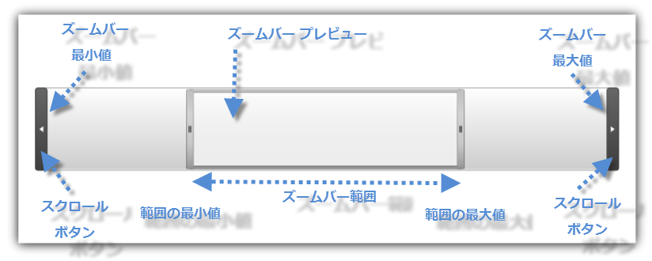
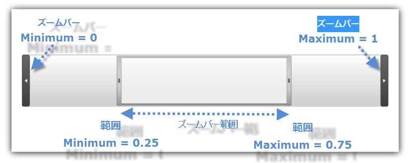
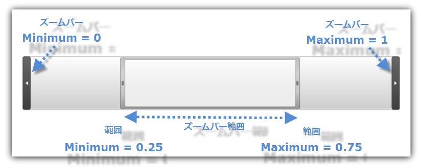

////
|metadata|
{
    "name": "xamzoombar-getting-started-with-xamzoombar",
    "controlName": ["xamZoombar"],
    "tags": ["Getting Started","Navigation"],
    "guid": "91f8b32c-ab76-4658-aa4f-30654d79c3b6",
    "buildFlags": [],
    "createdOn": "2016-05-25T18:22:00.2114019Z"
}
|metadata|
////

= xamZoombar を使用した作業の開始

== 始める前に

link:{ApiPlatform}datavisualization{ApiVersion}~infragistics.controls.xamzoombar.html[xamZoombar] コントロールは、つまみ、2 つのボタン、およびプレビュー領域で構成されます。つまみは表示可能領域だけでなくズーム範囲を制御します。つまみのサイズを変更して、ズーム スケールを増減できます。ズーム範囲を変更するには、つまみを前後にスライドします。

以下の表で、xamZoombar コントロールの最も重要なプロパティの詳細を説明します。

[options="header", cols="a,a,a"]
|====
|プロパティ名|プロパティ タイプ|説明

| link:{ApiPlatform}datavisualization{ApiVersion}~infragistics.controls.xamzoombar~minimum.html[Minimum]
|double
|xamZoombar コントロールで Range 要素の最小可能値を決定します。

| link:{ApiPlatform}datavisualization{ApiVersion}~infragistics.controls.xamzoombar~maximum.html[Maximum]
|double
|xamZoombar コントロールで Range 要素の最大可能値を決定します。

| link:{ApiPlatform}datavisualization{ApiVersion}~infragistics.controls.xamzoombar~range.html[Range]
| link:{ApiPlatform}datavisualization{ApiVersion}~infragistics.controls.range.html[Range]
|xamZoombar コントロールで現在の範囲 (つまみの位置とサイズ) を決定します。

|====

== 達成すること

このセクションは、Microsoft® Visual Studio® および Expression Blend® で xamZoombar コントロールのプロジェクトを設定する方法を示します。

== xamZoombar を Visual Studio で表示

[start=1]
. Visual Studio で Microsoft® {PlatformName}® プロジェクトを作成します。
[start=2]
. 以下の NuGet パッケージ参照をアプリケーションに追加します。

** Infragistics.WPF.DataVisualization

+
NuGet フィードのセットアップと NuGet パッケージの追加の詳細については、link:nuget-feeds.html[NuGet フィード] ドキュメントを参照してください。

[start=3]
. xamZoombar コントロールの以下の名前空間宣言を追加します。

*XAML の場合:*

----
<xmlns:ig=http://schemas.infragistics.com/xaml/>
----

*Visual Basic の場合:*

----
Imports Infragistics.Controls
----

*C# の場合:*

----
using Infragistics.Controls;
----

[start=4]
. 以下の属性を指定して xamZoombar コントロールのインスタンスを追加します。

** 新しい xamZoombar オブジェクトを作成します。
** link:{ApiPlatform}datavisualization{ApiVersion}~infragistics.controls.xamzoombar~minimum.html[Minimum] プロパティを 0 に設定します。
** link:{ApiPlatform}datavisualization{ApiVersion}~infragistics.controls.xamzoombar~maximum.html[Maximum] プロパティを 1 に設定します。
** 新しい link:{ApiPlatform}datavisualization{ApiVersion}~infragistics.controls.range.html[Range] オブジェクトを作成します。
** Range オブジェクトで link:{ApiPlatform}datavisualization{ApiVersion}~infragistics.controls.range~minimum.html[Minimum] プロパティを 0.25 に設定します。
** Range オブジェクトで link:{ApiPlatform}datavisualization{ApiVersion}~infragistics.controls.range~maximum.html[Maximum] プロパティを 0.75 に設定します。

*XAML の場合:*

----
<ig:XamZoombar x:Name="zoombar" Minimum="0" Maximum="1">
        <ig:XamZoombar.Range>
                <ig:Range Minimum="0.25" Maximum="0.75" />
        </ig:XamZoombar.Range>
</ig:XamZoombar>
----

*Visual Basic の場合:*

----
Dim zoombar As New XamZoombar()
zoombar.Minimum = 0
zoombar.Maximum = 1
zoombar.Range = New Range() With { Key .Minimum = 0.25, Key .Maximum = 0.75 }
----

*C# の場合:*

----
XamZoombar zoombar = new XamZoombar();
zoombar.Minimum = 0;
zoombar.Maximum = 1;
zoombar.Range = new Range {Minimum = 0.25, Maximum = 0.75};
----

[start=5]
. プロジェクトを保存して実行します。xamZoombar コントロールは、以下の画像に表示するように、ロードしてコントロールの中央につまみを表示します。

== xamZoombar を Expression Blend で表示

[start=1]
. Expression Blend で Microsoft® {PlatformName}® プロジェクトを作成します。
[start=2]
. 以下の NuGet パッケージ参照をアプリケーションに追加します。

** Infragistics.WPF.DataVisualization

+
NuGet フィードのセットアップと NuGet パッケージの追加の詳細については、link:nuget-feeds.html[NuGet フィード] ドキュメントを参照してください。

[start=3]
. ツールボックスから xamZoombar コントロールを選択し、デザイン サーフェイスにドラッグします。
[start=4]
. xamZoombar コントロールのプロパティ タブで、xamZoombar プロパティまで下にスクロールします。

** link:{ApiPlatform}datavisualization{ApiVersion}~infragistics.controls.xamzoombar~minimum.html[Minimum] プロパティを 0 に設定します。
** link:{ApiPlatform}datavisualization{ApiVersion}~infragistics.controls.xamzoombar~maximum.html[Maximum] プロパティを 1 に設定します。
** 新しい link:{ApiPlatform}datavisualization{ApiVersion}~infragistics.controls.range.html[Range] オブジェクトを作成します。
** Range オブジェクトで link:{ApiPlatform}datavisualization{ApiVersion}~infragistics.controls.range~minimum.html[Minimum] プロパティを 0.25 に設定します。
** Range オブジェクトで link:{ApiPlatform}datavisualization{ApiVersion}~infragistics.controls.range~maximum.html[Maximum] プロパティを 0.75 に設定します。

image::images/xamZoombar_Getting_Started_with_xamZoombar_03.png[]

[start=5]
. プロジェクトを保存して実行します。xamZoombar コントロールは、以下の画像に表示するように、ロードしてコントロールの中央につまみを表示します。

== 関連トピック:

* link:xamzoombar-using-xamzoombar.html[シリーズの要件]