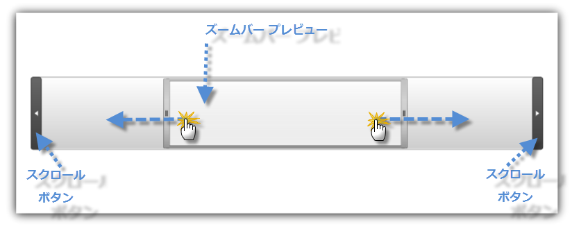
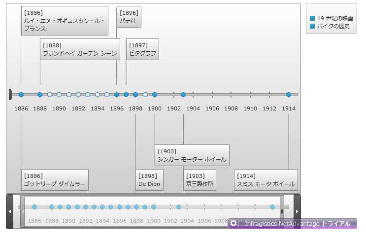
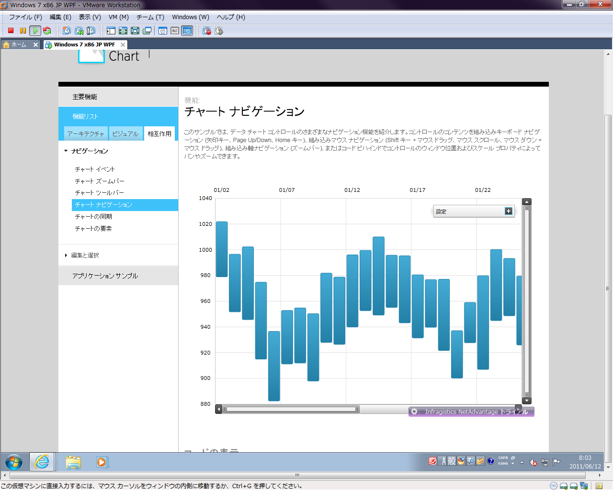

////

|metadata|
{
    "name": "xamzoombar-using-xamzoombar",
    "controlName": ["xamZoombar"],
    "tags": ["Getting Started"],
    "guid": "e3ecee0c-f139-491d-b4e4-9b8b7c161716",  
    "buildFlags": [],
    "createdOn": "2016-05-25T18:22:00.2224102Z"
}
|metadata|
////

= xamZoombar の使用

このセクションは、 link:{ApiPlatform}datavisualization{ApiVersion}~infragistics.controls.xamzoombar.html[xamZoombar] コントロールの重要な概念および機能を効果的に使用するためのタスク ベースの情報について説明します。

== ナビゲーション

このセクションは、xamZoombar コントロールをナビゲートする方法を示します。

xamZoombar コントロールを使用している場合、スクロールはつまみをスライドするか、スクロール ボタンをクリックして実行されます。次の画像は、xamZoombar コントロールのスクロール方法を示します。

xamZoombar コントロールの拡大は、つまみのサイズを変更することで実行されます。次の画像は、xamZoombar コントロールのズーム範囲を変更する方法を示します。

image::images/xamZoombar_Using_xamZoombar_02.png[]

== 統合

xamZoombar コントロールは、 link:{ApiPlatform}controls.charts.xamdatachart{ApiVersion}~infragistics.controls.charts.xamdatachart.html[xamDataChart] および link:{ApiPlatform}controls.timelines.xamtimeline{ApiVersion}~infragistics.controls.timelines.xamtimeline.html[xamTimeline] コントロールと完全に統合されています。このセクションは、xamZoombar をこれらのコントロールと使用する方法を示します。

== xamTimeline と統合

xamTimeline コントロールにはひとつの xamZoombar コントロールがあり、その外観とビヘイビアーは、以下の Timeline プロパティで制御されます:

[options="header", cols="a,a"]
|====
|プロパティ名|説明

|TimelineAxis.link:{ApiPlatform}controls.timelines.xamtimeline{ApiVersion}~infragistics.controls.timelines.timelineaxis~scrollscale.html[ScrollScale]
|このプロパティはタイムラインで倍率のレベルを設定します。この値は 0 と 1 の間の値で表現されます。たとえば、ScrollScale の .5 の値は 50% のタイムラインが表示されることを意味します。

|TimelineAxis.link:{ApiPlatform}controls.timelines.xamtimeline{ApiVersion}~infragistics.controls.timelines.timelineaxis~scrollposition.html[ScrollPosition]
|このプロパティは xamZoomBar のスライダーの位置を決定し、xamTimeline コントロールの現在の表示可能な領域を効果的に制御します。この値は 0 と 1 の間の値で表現されます。

|PreviewAxis.link:{ApiPlatform}controls.timelines.xamtimeline{ApiVersion}~infragistics.controls.timelines.rangeaxis~showlabels.html[ShowLabels]
|このプロパティは、xamZoombar のプレビュー領域でタイムライン ラベルを表示/非表示のいずれにするかを決定します。

|PreviewAxis.link:{ApiPlatform}controls.timelines.xamtimeline{ApiVersion}~infragistics.controls.timelines.rangeaxis~showminortickmarks.html[ShowMinorTickMarks]
|このプロパティは、xamZoombar のプレビュー領域でタイムラインの補助目盛を表示/非表示のいずれにするかを決定します。

|PreviewAxis.link:{ApiPlatform}controls.timelines.xamtimeline{ApiVersion}~infragistics.controls.timelines.rangeaxis~showmajortickmarks.html[ShowMajorTickMarks]
|このプロパティは、xamZoombar のプレビュー領域でタイムラインの主目盛を表示/非表示のいずれにするかを決定します。

|XamTimeline.link:{ApiPlatform}controls.timelines.xamtimeline{ApiVersion}~infragistics.controls.timelines.xamtimeline~zoombarstyle.html[ZoombarStyle]
|このプロパティは、xamZoombar コントロールの外観を決定します。

|XamTimeline.link:{ApiPlatform}controls.timelines.xamtimeline{ApiVersion}~infragistics.controls.timelines.xamtimeline~zoombar.html[Zoombar]
|この読み取り専用プロパティは、xamZoombar コントロールおよびそのプロパティへのアクセスを提供します。

|====

以下のコードは、タイムラインの中央に表示可能な部分を付け、半分のタイムラインを表示するズーム バーの表示方法を示します。

[NOTE]
====
*注:* この例は xamTimeline コントロール用のプロジェクトを設定済みであることを前提としています。
====

*XAML の場合:*

----
<ig:XamTimeline Margin="20">
       <ig:XamTimeline.PreviewAxis>
              <ig:PreviewAxis ShowLabels="True" ShowMajorTickMarks="True" ShowMinorTickMarks="True"/>
       </ig:XamTimeline.PreviewAxis>
       <ig:XamTimeline.Axis>
              <ig:NumericTimeAxis ScrollPosition="0.25" ScrollScale="0.5" />
       </ig:XamTimeline.Axis>
</ig:XamTimeline>
----

*Visual Basic の場合:*

----
Imports Infragistics.Controls.Timelines
' ...
Dim timeline As New XamTimeline()
timeline.PreviewAxis = New PreviewAxis() With { _
    Key .ShowLabels = True, _
    Key .ShowMajorTickMarks = True, _
    Key .ShowMinorTickMarks = True _
}
timeline.Axis = New NumericTimeAxis() With { _
    Key .ScrollScale = 0.25, _
    Key .ScrollPosition = 0.5 _
}
----

*C# の場合:*

----
using Infragistics.Controls.Timelines;
XamTimeline timeline = newXamTimeline();
timeline.PreviewAxis = newPreviewAxis
                            {
                                ShowLabels = true, 
                                ShowMajorTickMarks = true, 
                                ShowMinorTickMarks = true
                            };
timeline.Axis = newNumericTimeAxis
                    {
                        ScrollScale = 0.25, 
                        ScrollPosition = 0.5
                    };
----

== xamDataChart と統合

xamDataChart コントロールには、ひとつの水平方向の xamZoombar とひとつの垂直方向の xamZoombar があります。外観とビヘイビアーは、以下の Data Chart プロパティで制御されます:

[options="header", cols="a,a"]
|====
|プロパティ名|説明

| link:{ApiPlatform}controls.charts.xamdatachart{ApiVersion}~infragistics.controls.charts.xamdatachart~horizontalzoombarvisibility.html[HorizontalZoombarVisibility]
|このプロパティは、データ チャートの下に水平方向の xamZoombar コントロールを表示/非表示のいずれにするかを決定します。

| link:{ApiPlatform}controls.charts.xamdatachart{ApiVersion}~infragistics.controls.charts.xamdatachart~verticalzoombarvisibility.html[VerticalZoombarVisibility]
|このプロパティは、データ チャートの右に垂直方向の xamZoombar コントロールを表示/非表示のいずれにするかを決定します。

| link:{ApiPlatform}controls.charts.xamdatachart{ApiVersion}~infragistics.controls.seriesviewer~windowpositionhorizontal.html[WindowPositionHorizontal]
|このプロパティは水平方向の xamZoombar のつまみ位置を決定します。これは、xamDataChart で表示されるコンテンツ ビュー矩形の X 部分に対応します。デフォルト値はゼロで、データ チャートの左からコントロールのコンテンツのすべてを表示するために変換します。

| link:{ApiPlatform}controls.charts.xamdatachart{ApiVersion}~infragistics.controls.seriesviewer~windowpositionvertical.html[WindowPositionVertical]
|このプロパティは垂直方向の xamZoombar のつまみ位置を決定します。これは、xamDataChart で表示されるコンテンツ ビュー矩形の Y 部分に対応します。デフォルト値はゼロで、データ チャートの左からコントロールのコンテンツのすべてを表示するために変換します。

| link:{ApiPlatform}controls.charts.xamdatachart{ApiVersion}~infragistics.controls.charts.xamdatachart~windowscalehorizontal.html[WindowScaleHorizontal]
|このプロパティは水平方向の xamZoombar のつまみサイズを決定します。これは、xamDataChart で表示されるコンテンツ ビュー矩形の Width 部分に対応します。デフォルト値は 1 で、X 軸に沿ってデータ チャート コンテンツのすべてを表示するために変換します。

| link:{ApiPlatform}controls.charts.xamdatachart{ApiVersion}~infragistics.controls.charts.xamdatachart~windowscalevertical.html[WindowScaleVertical]
|このプロパティは垂直方向の xamZoombar のつまみサイズを決定します。これは、xamDataChart で表示されるコンテンツ ビュー矩形の Width 部分に対応します。デフォルト値は 1 で、Y 軸に沿ってデータ チャート コンテンツのすべてを表示するために変換します。

| link:{ApiPlatform}controls.charts.xamdatachart{ApiVersion}~infragistics.controls.seriesviewer~zoombarstyle.html[ZoombarStyle]
|このプロパティは、xamZoombar コントロールの外観を決定します。

|====

以下のコードは、データ チャートの中央に表示可能な部分を付け、データ チャートの半分を表示する xamZoombar コントロールの表示方法を示します。

[NOTE]
====
*注:* この例は xamDataChart コントロール用のプロジェクトを設定済みであることを前提としています。
====

*XAML の場合:*

----
<ig:XamDataChart x:Name="DataChart"
                 WindowPositionHorizontal="0.25"
                 WindowPositionVertical="0.25"
                 WindowScaleHorizontal="0.5"
                 WindowScaleVertical="0.5"
                 HorizontalZoomable="True"
                 HorizontalZoombarVisibility="Visible"
                 VerticalZoomable="True"
                 VerticalZoombarVisibility="Visible">
</ig:XamDataChart>
----

*Visual Basic の場合:*

----
Imports Infragistics.Controls.Charts
' ...
Dim dataChart As New XamDataChart()
dataChart.WindowPositionHorizontal = 0.25
dataChart.WindowPositionVertical = 0.25
dataChart.WindowScaleHorizontal = 0.5
dataChart.WindowScaleVertical = 0.5
dataChart.HorizontalZoomable = True
dataChart.HorizontalZoombarVisibility = Visibility.Visible
dataChart.VerticalZoombarVisibility = Visibility.Visible
dataChart.VerticalZoomable = True
----

*C# の場合:*

----
using Infragistics.Controls.Charts;
// ...
XamDataChart dataChart = new XamDataChart();
dataChart.WindowPositionHorizontal = 0.25;
dataChart.WindowPositionVertical = 0.25;
dataChart.WindowScaleHorizontal = 0.5;
dataChart.WindowScaleVertical = 0.5;
dataChart.HorizontalZoomable = true;
dataChart.HorizontalZoombarVisibility = Visibility.Visible;
dataChart.VerticalZoombarVisibility = Visibility.Visible;
dataChart.VerticalZoomable = true;
----

== 関連トピック:

* link:xamzoombar-getting-started-with-xamzoombar.html[xamZoombar を使用した作業の開始]